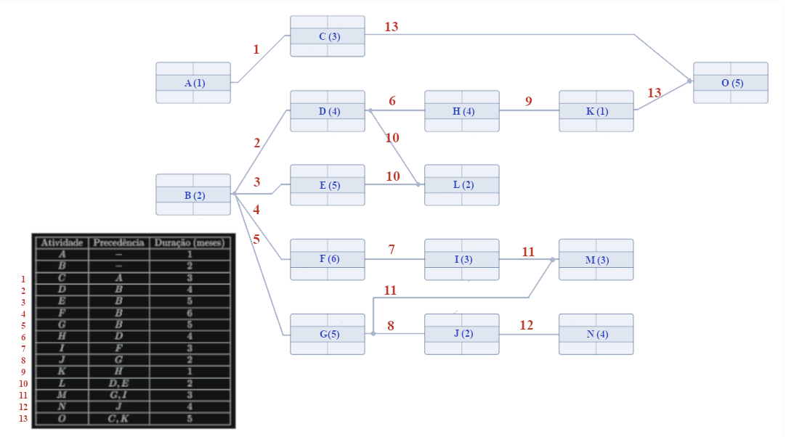
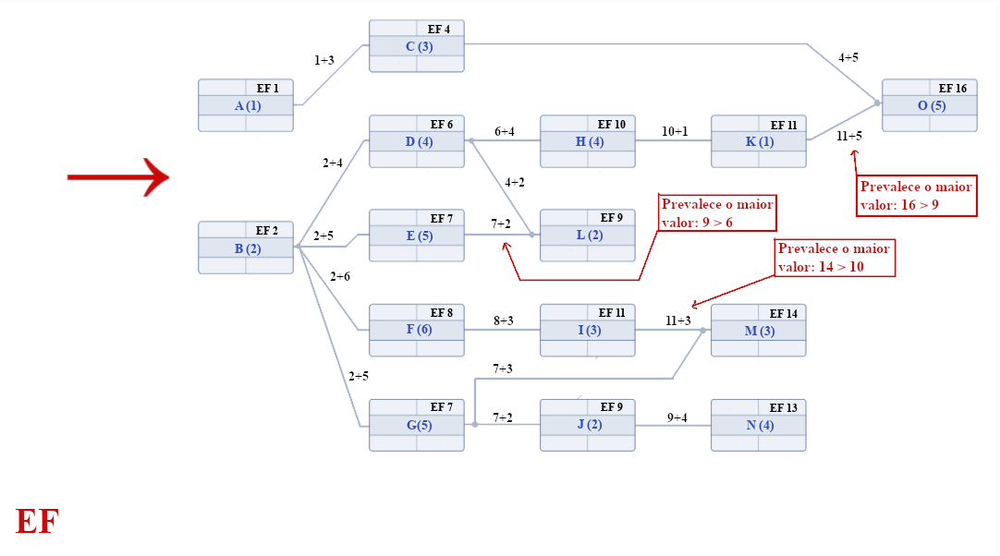
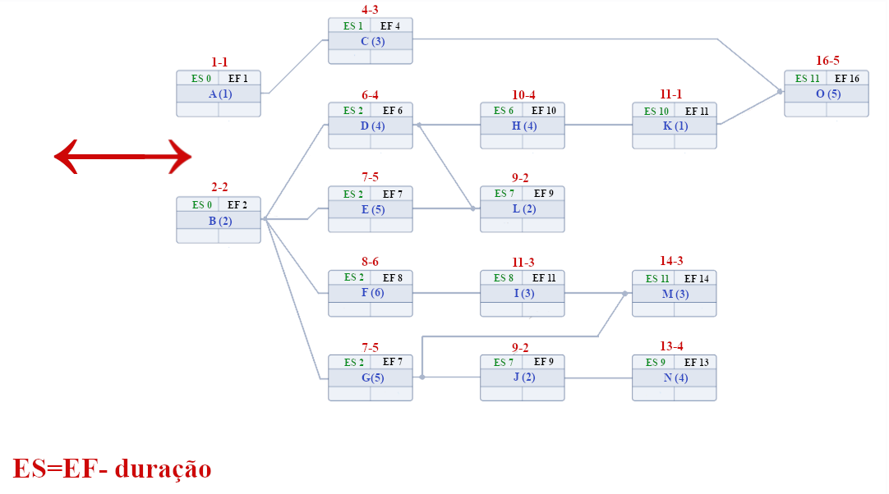
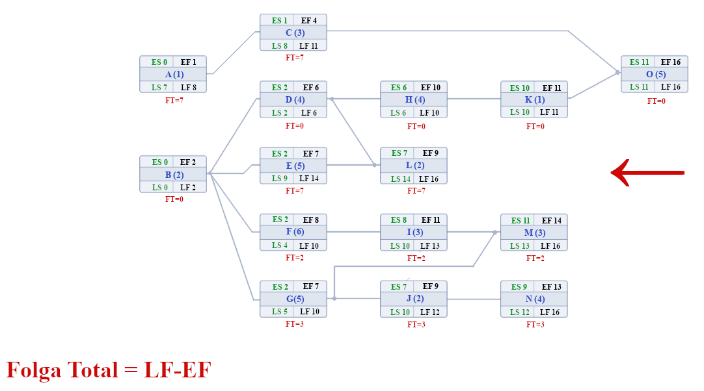
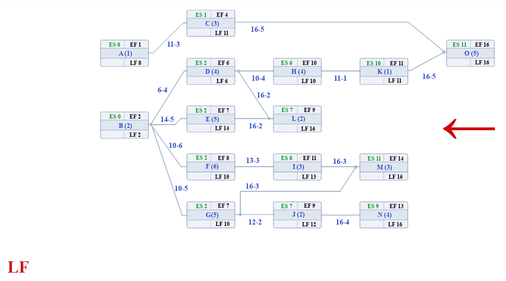
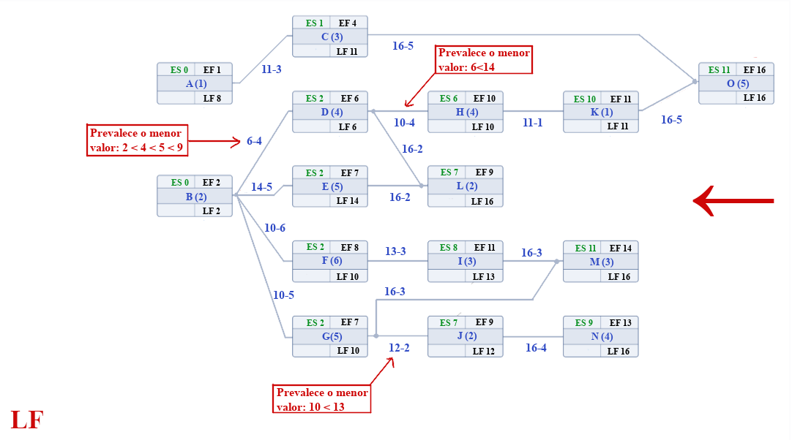
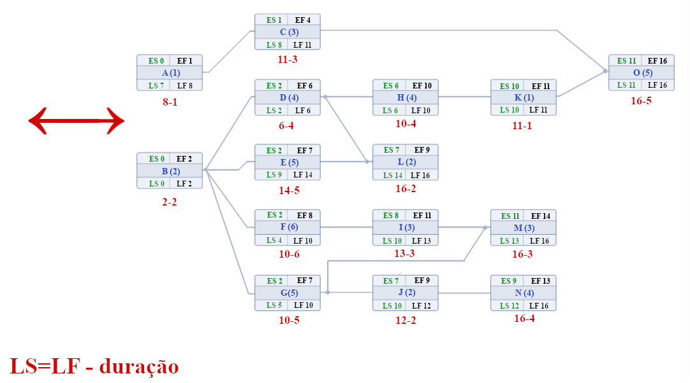
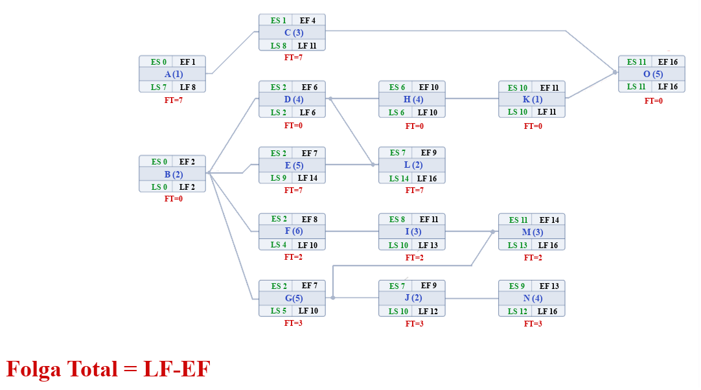
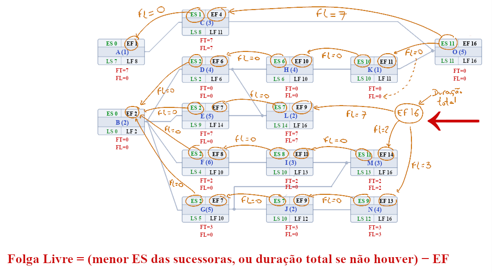
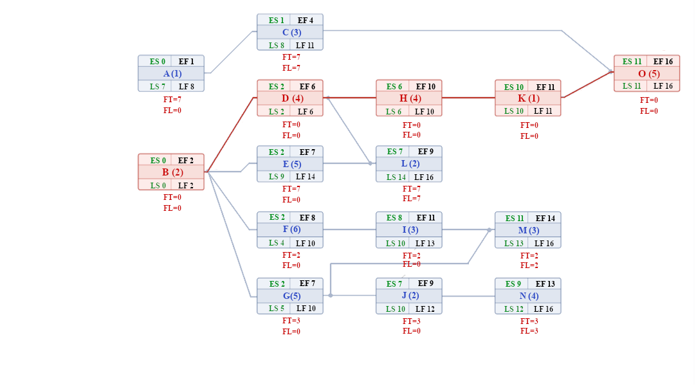

# Rede AON - Exercício 01

Para uma rede AON, as atividades são conectadas uma com as outras de acordo com as precedências. As atividades A e B não tem atividades precedentes, portanto, são as atividades que iniciam a rede. 

Os Términos mais cedo (EF) são calculados através da soma de duas atividades: a antecedora e a sucessora. As atividades A e B não possuem atividades precedentes, então EF corresponde a sua duração. 

As atividades que possuem mais de uma precedência, terão mais de um valor de EF, e a escolha é pelo maior valor obtido. 

A direção das somas segue da esquerda para direita.

O Início mais cedo (ES) para cada atividade é calculado pela diferença entre o valor de EF e sua duração. Independe a direção dos cálculos, pois depende apenas dos dados isolados em cada atividade. 

O Término mais tarde (LF) tem como referência inicial o maior EF entre as atividades. A direção das diferenças é feita da direita para a esquerda.

Note que as atividades da extremidade direita herdam o valor de LF maior.

Ao realizar o cálculo das atividades antecessoras, subtraímos os valor da LF sucessora com a duração da atividade antecessora. 

O critério de prevalência de mais de uma atividade é pelo menor valor obtido.

O cálculo para Início mais tarde (LS) é obtido pela diferença do valor de LF pela duração da atividade. Independe a direção dos cálculos, pois depende apenas dos dados isolados em cada atividade. 

A Folga Total (FT) independe também da direção dos cálculos, já que necessitamos dos valores de LF e EF, em cada atividade.

Note que temos uma sequência de atividades com FT=0, indicando o Caminho crítico da rede.

A Folga Livre (FL) depende apenas dos valores da ES sucessora e da EF antecessora. E a direção dos cálculos é da direita para a esquerda.

Finalmente temos a rede AON completa, com todos os parâmetros calculados. Em vermelho o caminho crítico é destacado, enquanto que os demais são caminhos não críticos.

