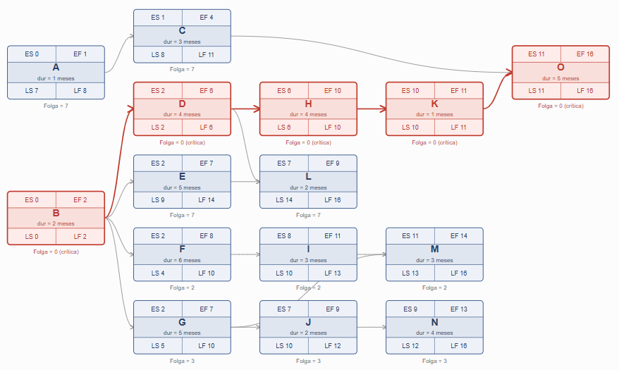
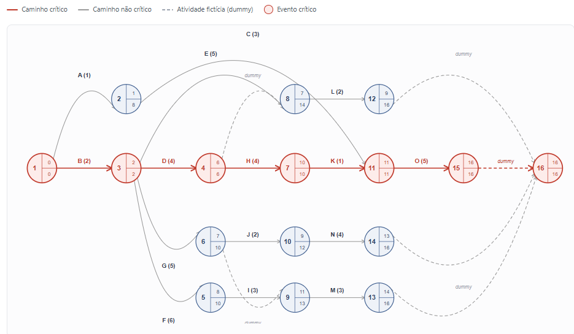

# Rede PERT/CPM do Projeto

Diagrama de rede AON (Activity-on-Node) com cálculo de datas cedo/tarde, folgas e caminho crítico.

$$
\begin{array}{|c|c|c|}
\hline \text{Atividade} & \text{Precedência} & \text{Duração (meses)}\\
\hline A&-&1\\
\hline B&-&2\\
\hline C&A&3\\
\hline D&B&4\\
\hline E&B&5\\
\hline F&B&6\\
\hline G&B&5\\
\hline H&D&4\\
\hline I&F&3\\
\hline J&G&2\\
\hline K&H&1\\
\hline L&D,E&2\\
\hline M&G,I&3\\
\hline N&J&4\\
\hline O&C,K&5\\
\hline
\end{array}
$$

<h1>Rede PERT/CPM — Cálculo Completo</h1>

Método Francês (AON) e Método Americano (AOA), com todos os cálculos — ES, EF, LS, LF, Folga Total e Folga Livre

  Duração total do projeto: <b>16 meses</b> em ambos os métodos — caminho crítico: <b>B → D → H → K → O</b>

<h2>Parte 1 — Método Francês (AON)</h2>

<a href="metodoaon_1.md">Rede AON Ex. 01 - Passo-a-passo</a>

<h3>1.1 Rede AON</h3>

<h3>1.2 Tabela Completa de Cálculo</h3>

ES = maior EF entre predecessoras &nbsp;|&nbsp; EF = ES + duração &nbsp;|&nbsp; LF = menor LS entre sucessoras &nbsp;|&nbsp; LS = LF − duração 
Folga Total = LS − ES &nbsp;|&nbsp; Folga Livre = (menor ES das sucessoras, ou duração total se não houver) − EF

<table>
  <tr>
    <th>Ativ.</th><th>Dur.</th><th>Prec.</th><th>ES</th><th>EF</th><th>LS</th><th>LF</th>
    <th>Folga Total</th><th>Folga Livre</th><th>Crítica?</th>
  </tr>
  <tr><td>A</td><td>1</td><td>-----</td><td>0</td><td>1</td><td>7</td><td>8</td><td>7</td><td>0</td><td>Não</td></tr>
<tr style="background:#fdecea;font-weight:600;"><td>B</td><td>2</td><td>-----</td><td>0</td><td>2</td><td>0</td><td>2</td><td>0</td><td>0</td><td>Sim</td></tr>
<tr><td>C</td><td>3</td><td>A</td><td>1</td><td>4</td><td>8</td><td>11</td><td>7</td><td>7</td><td>Não</td></tr>
<tr style="background:#fdecea;font-weight:600;"><td>D</td><td>4</td><td>B</td><td>2</td><td>6</td><td>2</td><td>6</td><td>0</td><td>0</td><td>Sim</td></tr>
<tr><td>E</td><td>5</td><td>B</td><td>2</td><td>7</td><td>9</td><td>14</td><td>7</td><td>0</td><td>Não</td></tr>
<tr><td>F</td><td>6</td><td>B</td><td>2</td><td>8</td><td>4</td><td>10</td><td>2</td><td>0</td><td>Não</td></tr>
<tr><td>G</td><td>5</td><td>B</td><td>2</td><td>7</td><td>5</td><td>10</td><td>3</td><td>0</td><td>Não</td></tr>
<tr style="background:#fdecea;font-weight:600;"><td>H</td><td>4</td><td>D</td><td>6</td><td>10</td><td>6</td><td>10</td><td>0</td><td>0</td><td>Sim</td></tr>
<tr><td>I</td><td>3</td><td>F</td><td>8</td><td>11</td><td>10</td><td>13</td><td>2</td><td>0</td><td>Não</td></tr>
<tr><td>J</td><td>2</td><td>G</td><td>7</td><td>9</td><td>10</td><td>12</td><td>3</td><td>0</td><td>Não</td></tr>
<tr style="background:#fdecea;font-weight:600;"><td>K</td><td>1</td><td>H</td><td>10</td><td>11</td><td>10</td><td>11</td><td>0</td><td>0</td><td>Sim</td></tr>
<tr><td>L</td><td>2</td><td>D, E</td><td>7</td><td>9</td><td>14</td><td>16</td><td>7</td><td>7</td><td>Não</td></tr>
<tr><td>M</td><td>3</td><td>G, I</td><td>11</td><td>14</td><td>13</td><td>16</td><td>2</td><td>2</td><td>Não</td></tr>
<tr><td>N</td><td>4</td><td>J</td><td>9</td><td>13</td><td>12</td><td>16</td><td>3</td><td>3</td><td>Não</td></tr>
<tr style="background:#fdecea;font-weight:600;"><td>O</td><td>5</td><td>C, K</td><td>11</td><td>16</td><td>11</td><td>16</td><td>0</td><td>0</td><td>Sim</td></tr>
</table>

<h2>Parte 2 — Método Americano (AOA)</h2>

<a href="metodoaoa_1.md">Rede AOA Ex. 01 - Passo-a-passo</a>
<h3>2.1 Rede AOA (numeração atual)</h3>

<h3>2.2 Tabela de Tempos dos Eventos (TE / TL)</h3>

TE(evento) = maior [TE(origem) + duração] entre as setas que chegam &nbsp;|&nbsp;
TL(evento) = menor [TL(destino) − duração] entre as setas que saem

<table>
  <tr><th>Evento</th><th>Significado</th><th>TE</th><th>TL</th><th>Folga do evento</th><th>Crítico?</th></tr>
  <tr style="background:#fdecea;font-weight:600;"><td>1</td><td style='text-align:left;'>Início do projeto</td><td>0</td><td>0</td><td>0</td><td>Sim</td></tr>
<tr><td>2</td><td style='text-align:left;'>Fim de A</td><td>1</td><td>8</td><td>7</td><td>Não</td></tr>
<tr style="background:#fdecea;font-weight:600;"><td>3</td><td style='text-align:left;'>Fim de B</td><td>2</td><td>2</td><td>0</td><td>Sim</td></tr>
<tr style="background:#fdecea;font-weight:600;"><td>4</td><td style='text-align:left;'>Fim de D</td><td>6</td><td>6</td><td>0</td><td>Sim</td></tr>
<tr><td>5</td><td style='text-align:left;'>Fim de F</td><td>8</td><td>10</td><td>2</td><td>Não</td></tr>
<tr><td>6</td><td style='text-align:left;'>Fim de G</td><td>7</td><td>10</td><td>3</td><td>Não</td></tr>
<tr style="background:#fdecea;font-weight:600;"><td>7</td><td style='text-align:left;'>Fim de H</td><td>10</td><td>10</td><td>0</td><td>Sim</td></tr>
<tr><td>8</td><td style='text-align:left;'>Convergência D+E (início de L)</td><td>7</td><td>14</td><td>7</td><td>Não</td></tr>
<tr><td>9</td><td style='text-align:left;'>Convergência G+I (início de M)</td><td>11</td><td>13</td><td>2</td><td>Não</td></tr>
<tr><td>10</td><td style='text-align:left;'>Fim de J</td><td>9</td><td>12</td><td>3</td><td>Não</td></tr>
<tr style="background:#fdecea;font-weight:600;"><td>11</td><td style='text-align:left;'>Convergência C+K (início de O)</td><td>11</td><td>11</td><td>0</td><td>Sim</td></tr>
<tr><td>12</td><td style='text-align:left;'>Fim de L</td><td>9</td><td>16</td><td>7</td><td>Não</td></tr>
<tr><td>13</td><td style='text-align:left;'>Fim de M</td><td>14</td><td>16</td><td>2</td><td>Não</td></tr>
<tr><td>14</td><td style='text-align:left;'>Fim de N</td><td>13</td><td>16</td><td>3</td><td>Não</td></tr>
<tr style="background:#fdecea;font-weight:600;"><td>15</td><td style='text-align:left;'>Fim de O</td><td>16</td><td>16</td><td>0</td><td>Sim</td></tr>
<tr style="background:#fdecea;font-weight:600;"><td>16</td><td style='text-align:left;'>Fim do projeto</td><td>16</td><td>16</td><td>0</td><td>Sim</td></tr>
</table>

<h3>2.3 Tabela Completa de Cálculo por Atividade (derivada dos eventos)</h3>

Para uma atividade que liga o evento <b>i</b> ao evento <b>j</b>, com duração <b>d</b>: 
ES = TE(i) &nbsp;|&nbsp; EF = TE(i) + d &nbsp;|&nbsp; LF = TL(j) &nbsp;|&nbsp; LS = TL(j) − d 
Folga Total = TL(j) − TE(i) − d &nbsp;|&nbsp; Folga Livre = TE(j) − TE(i) − d
 * Para as atividades finais (L, M, N, O), como o evento de chegada só leva a uma dummy até o fim do projeto, a Folga Livre usa TE do evento 16 no lugar de TE(j).

<table>
  <tr>
    <th>Ativ.</th><th>Dur.</th><th>Prec.</th><th>Arco (i→j)</th><th>ES</th><th>EF</th><th>LS</th><th>LF</th>
    <th>Folga Total</th><th>Folga Livre</th><th>Crítica?</th>
  </tr>
  <tr><td>A</td><td>1</td><td>-----</td><td>1→2</td><td>0</td><td>1</td><td>7</td><td>8</td><td>7</td><td>0</td><td>Não</td></tr>
<tr style="background:#fdecea;font-weight:600;"><td>B</td><td>2</td><td>-----</td><td>1→3</td><td>0</td><td>2</td><td>0</td><td>2</td><td>0</td><td>0</td><td>Sim</td></tr>
<tr><td>C</td><td>3</td><td>A</td><td>2→11</td><td>1</td><td>4</td><td>8</td><td>11</td><td>7</td><td>7</td><td>Não</td></tr>
<tr style="background:#fdecea;font-weight:600;"><td>D</td><td>4</td><td>B</td><td>3→4</td><td>2</td><td>6</td><td>2</td><td>6</td><td>0</td><td>0</td><td>Sim</td></tr>
<tr><td>E</td><td>5</td><td>B</td><td>3→8</td><td>2</td><td>7</td><td>9</td><td>14</td><td>7</td><td>0</td><td>Não</td></tr>
<tr><td>F</td><td>6</td><td>B</td><td>3→5</td><td>2</td><td>8</td><td>4</td><td>10</td><td>2</td><td>0</td><td>Não</td></tr>
<tr><td>G</td><td>5</td><td>B</td><td>3→6</td><td>2</td><td>7</td><td>5</td><td>10</td><td>3</td><td>0</td><td>Não</td></tr>
<tr style="background:#fdecea;font-weight:600;"><td>H</td><td>4</td><td>D</td><td>4→7</td><td>6</td><td>10</td><td>6</td><td>10</td><td>0</td><td>0</td><td>Sim</td></tr>
<tr><td>I</td><td>3</td><td>F</td><td>5→9</td><td>8</td><td>11</td><td>10</td><td>13</td><td>2</td><td>0</td><td>Não</td></tr>
<tr><td>J</td><td>2</td><td>G</td><td>6→10</td><td>7</td><td>9</td><td>10</td><td>12</td><td>3</td><td>0</td><td>Não</td></tr>
<tr style="background:#fdecea;font-weight:600;"><td>K</td><td>1</td><td>H</td><td>7→11</td><td>10</td><td>11</td><td>10</td><td>11</td><td>0</td><td>0</td><td>Sim</td></tr>
<tr><td>L</td><td>2</td><td>D, E</td><td>8→12</td><td>7</td><td>9</td><td>14</td><td>16</td><td>7</td><td>7</td><td>Não</td></tr>
<tr><td>M</td><td>3</td><td>G, I</td><td>9→13</td><td>11</td><td>14</td><td>13</td><td>16</td><td>2</td><td>2</td><td>Não</td></tr>
<tr><td>N</td><td>4</td><td>J</td><td>10→14</td><td>9</td><td>13</td><td>12</td><td>16</td><td>3</td><td>3</td><td>Não</td></tr>
<tr style="background:#fdecea;font-weight:600;"><td>O</td><td>5</td><td>C, K</td><td>11→15</td><td>11</td><td>16</td><td>11</td><td>16</td><td>0</td><td>0</td><td>Sim</td></tr>
</table>

<h2>Parte 3 — Confirmação: os dois métodos batem</h2>

Comparando linha a linha as duas tabelas completas (1.2 e 2.3), os valores de <b>ES, EF, LS, LF, Folga Total e Folga Livre são idênticos</b> para todas as 15 atividades, nos dois métodos. Isso confirma, de forma numérica e definitiva, que AON e AOA são duas representações gráficas equivalentes do mesmo cálculo de CPM — a estrutura do desenho muda, mas nenhum resultado muda.

<ul>
  <li><b>Duração total do projeto:</b> 16 meses (idêntico nos dois métodos)</li>
  <li><b>Caminho crítico:</b> B → D → H → K → O (idêntico nos dois métodos, folga total = 0)</li>
  <li><b>Atividades com maior folga:</b> C e L (folga total = folga livre = 7 meses) em ambos os métodos</li>
</ul>
