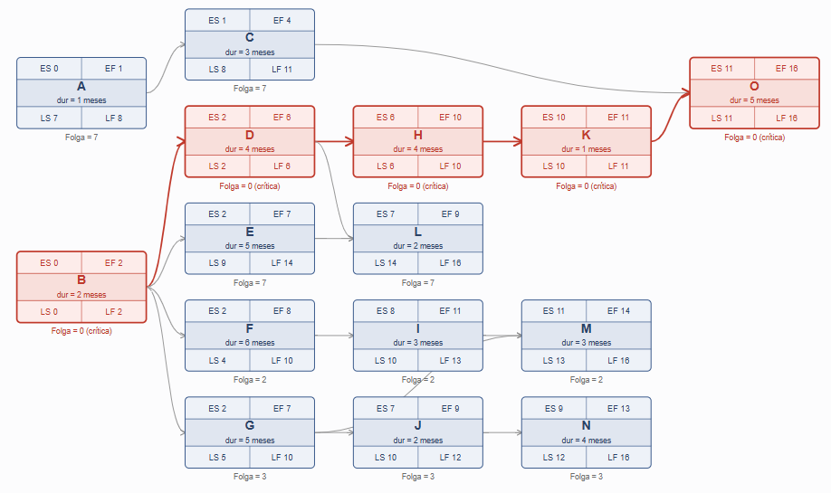
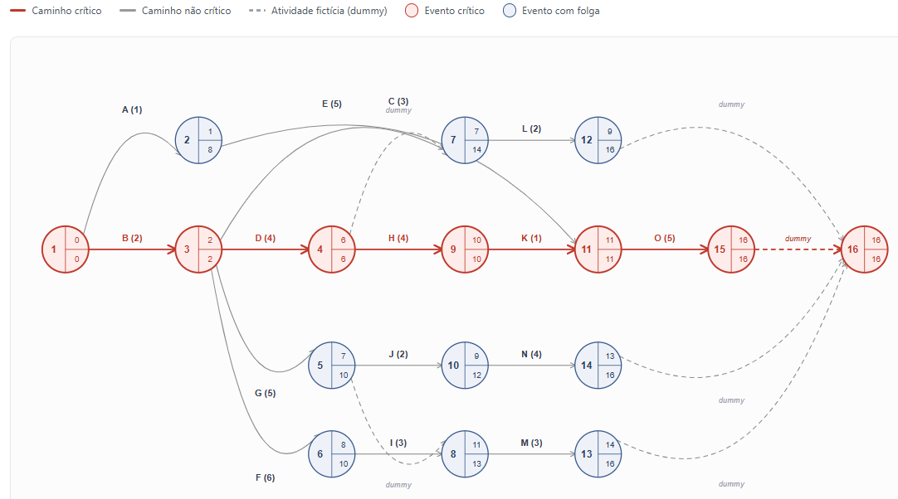

# Rede PERT/CPM do Projeto

Diagrama de rede AON (Activity-on-Node) com cálculo de datas cedo/tarde, folgas e caminho crítico.

  Duração total do projeto: <b>16 meses</b> — definida pelo caminho crítico $B \Rightarrow D \Rightarrow H \Rightarrow K \Rightarrow O \quad \text{(2 + 4 + 4 + 1 + 5 = 16 meses)}$

## 1. Rede AON (Activity-on-Node)

 
Cada nó traz: <b>ES</b> (início mais cedo), <b>EF</b> (fim mais cedo), <b>LS</b> (início mais tarde), <b>LF</b> (fim mais tarde) e a folga (LS − ES). Atividades com folga = 0 formam o caminho crítico.

## 2. Tabela de Cálculo (CPM)

<table>
  <tr>
    <th>Atividade</th><th>Duração (meses)</th><th>Precedências</th>
    <th>ES</th><th>EF</th><th>LS</th><th>LF</th><th>Folga</th><th>Crítica?</th>
  </tr>
  <tr><td>A</td><td>1</td><td>-----</td><td>0</td><td>1</td><td>7</td><td>8</td><td>7</td><td>Não</td></tr>
<tr style="background:#fdecea;font-weight:600;"><td>B</td><td>2</td><td>-----</td><td>0</td><td>2</td><td>0</td><td>2</td><td>0</td><td>Sim</td></tr>
<tr><td>C</td><td>3</td><td>A</td><td>1</td><td>4</td><td>8</td><td>11</td><td>7</td><td>Não</td></tr>
<tr style="background:#fdecea;font-weight:600;"><td>D</td><td>4</td><td>B</td><td>2</td><td>6</td><td>2</td><td>6</td><td>0</td><td>Sim</td></tr>
<tr><td>E</td><td>5</td><td>B</td><td>2</td><td>7</td><td>9</td><td>14</td><td>7</td><td>Não</td></tr>
<tr><td>F</td><td>6</td><td>B</td><td>2</td><td>8</td><td>4</td><td>10</td><td>2</td><td>Não</td></tr>
<tr><td>G</td><td>5</td><td>B</td><td>2</td><td>7</td><td>5</td><td>10</td><td>3</td><td>Não</td></tr>
<tr style="background:#fdecea;font-weight:600;"><td>H</td><td>4</td><td>D</td><td>6</td><td>10</td><td>6</td><td>10</td><td>0</td><td>Sim</td></tr>
<tr><td>I</td><td>3</td><td>F</td><td>8</td><td>11</td><td>10</td><td>13</td><td>2</td><td>Não</td></tr>
<tr><td>J</td><td>2</td><td>G</td><td>7</td><td>9</td><td>10</td><td>12</td><td>3</td><td>Não</td></tr>
<tr style="background:#fdecea;font-weight:600;"><td>K</td><td>1</td><td>H</td><td>10</td><td>11</td><td>10</td><td>11</td><td>0</td><td>Sim</td></tr>
<tr><td>L</td><td>2</td><td>D, E</td><td>7</td><td>9</td><td>14</td><td>16</td><td>7</td><td>Não</td></tr>
<tr><td>M</td><td>3</td><td>G, I</td><td>11</td><td>14</td><td>13</td><td>16</td><td>2</td><td>Não</td></tr>
<tr><td>N</td><td>4</td><td>J</td><td>9</td><td>13</td><td>12</td><td>16</td><td>3</td><td>Não</td></tr>
<tr style="background:#fdecea;font-weight:600;"><td>O</td><td>5</td><td>C, K</td><td>11</td><td>16</td><td>11</td><td>16</td><td>0</td><td>Sim</td></tr>
</table>

## 3. Como o cálculo foi feito

<b>Passagem de avanço (forward pass)</b> — calcula ES e EF de cada atividade:

<ul>
  <li>ES de uma atividade = maior EF entre todas as suas predecessoras (0 se não tiver predecessora);</li>
  <li>EF = ES + duração da atividade.</li>
</ul>

<b>Passagem de retorno (backward pass)</b> — calcula LS e LF, partindo da duração total do projeto (16 meses):

<ul>
  <li>LF de uma atividade = menor LS entre todas as suas sucessoras (igual à duração do projeto se não tiver sucessora);</li>
  <li>LS = LF − duração da atividade.</li>
</ul>

<b>Folga (slack)</b> = LS − ES (ou LF − EF). Atividades com folga igual a zero não podem atrasar sem atrasar o projeto inteiro — são as atividades <b>críticas</b>, e a sequência delas forma o <b>caminho crítico</b>.

## 4. Caminho Crítico

O caminho crítico do projeto é:

$B(2) \Rightarrow D(4) \Rightarrow H(4) \Rightarrow K(1) \Rightarrow O(5) = \text{16 meses}$

Todas as demais atividades (A, C, E, F, G, I, J, L, M, N) possuem folga e podem, dentro do limite indicado na tabela, atrasar sem comprometer o prazo final de 16 meses — desde que essa folga não seja excedida.

# Rede PERT/CPM — Método Americano (AOA)

Diagrama Activity-on-Arrow (atividade-na-seta), com eventos numerados, atividades fictícias (dummies) e comparação com o método francês (AON).

Duração total do projeto: <b>16 meses</b> — mesmo resultado do método AON, pelo caminho crítico $1 \Rightarrow 3 \Rightarrow 4 \Rightarrow 9 \Rightarrow 11 \Rightarrow 15 (atividades) B \Rightarrow D \Rightarrow H \Rightarrow K \Rightarrow O$

## 1. Rede AOA (Activity-on-Arrow)

 

Cada evento (círculo) é dividido em três campos: <b>número do evento</b> (esquerda), <b>TE</b> — tempo mais cedo (canto superior direito) e <b>TL</b> — tempo mais tarde (canto inferior direito). As setas tracejadas são atividades fictícias (dummies), com duração zero, usadas apenas para preservar a lógica de precedência.

## 2. Por que precisamos de dummies aqui

<ul>
  <li><b>Evento 7 (tail de L):</b> a atividade L depende de D <i>e</i> E. Como H depende só de D, o evento 4 (fim de D) não pode ser o mesmo evento que "libera" L — então a atividade E chega diretamente ao evento 7, e uma dummy parte do evento 4 (fim de D) até o evento 7, garantindo que L só comece quando D <i>e</i> E estiverem prontas.</li>
  <li><b>Evento 8 (tail de M):</b> mesma lógica — M depende de G <i>e</i> I. J depende só de G, então G não pode "liberar" M sozinho. A atividade I chega direto ao evento 8, e uma dummy parte do evento 5 (fim de G) até o evento 8.</li>
  <li><b>Evento 11 (tail de O):</b> como nem C nem K alimentam mais nenhuma outra atividade, elas convergem diretamente no mesmo evento — <b>não é necessária dummy aqui</b>.</li>
  <li><b>Dummies finais (12→16, 13→16, 14→16, 15→16):</b> usadas apenas para unificar as quatro atividades "fim de rede" (L, M, N, O) em um único evento de término do projeto, permitindo ler a duração total em um só lugar.</li>
</ul>

## 3. Tabela de Tempos dos Eventos

<table>
  <tr><th>Evento</th><th>Significado</th><th>TE</th><th>TL</th><th>Folga</th><th>Crítico?</th></tr>
  <tr style="background:#fdecea;font-weight:600;"><td>1</td><td style='text-align:left;'>Início do projeto</td><td>0</td><td>0</td><td>0</td><td>Sim</td></tr>
<tr><td>2</td><td style='text-align:left;'>Fim de A</td><td>1</td><td>8</td><td>7</td><td>Não</td></tr>
<tr style="background:#fdecea;font-weight:600;"><td>3</td><td style='text-align:left;'>Fim de B</td><td>2</td><td>2</td><td>0</td><td>Sim</td></tr>
<tr style="background:#fdecea;font-weight:600;"><td>4</td><td style='text-align:left;'>Fim de D</td><td>6</td><td>6</td><td>0</td><td>Sim</td></tr>
<tr><td>5</td><td style='text-align:left;'>Fim de G</td><td>7</td><td>10</td><td>3</td><td>Não</td></tr>
<tr><td>6</td><td style='text-align:left;'>Fim de F</td><td>8</td><td>10</td><td>2</td><td>Não</td></tr>
<tr><td>7</td><td style='text-align:left;'>Convergência D+E (início de L)</td><td>7</td><td>14</td><td>7</td><td>Não</td></tr>
<tr><td>8</td><td style='text-align:left;'>Convergência G+I (início de M)</td><td>11</td><td>13</td><td>2</td><td>Não</td></tr>
<tr style="background:#fdecea;font-weight:600;"><td>9</td><td style='text-align:left;'>Fim de H</td><td>10</td><td>10</td><td>0</td><td>Sim</td></tr>
<tr><td>10</td><td style='text-align:left;'>Fim de J</td><td>9</td><td>12</td><td>3</td><td>Não</td></tr>
<tr style="background:#fdecea;font-weight:600;"><td>11</td><td style='text-align:left;'>Convergência C+K (início de O)</td><td>11</td><td>11</td><td>0</td><td>Sim</td></tr>
<tr><td>12</td><td style='text-align:left;'>Fim de L</td><td>9</td><td>16</td><td>7</td><td>Não</td></tr>
<tr><td>13</td><td style='text-align:left;'>Fim de M</td><td>14</td><td>16</td><td>2</td><td>Não</td></tr>
<tr><td>14</td><td style='text-align:left;'>Fim de N</td><td>13</td><td>16</td><td>3</td><td>Não</td></tr>
<tr style="background:#fdecea;font-weight:600;"><td>15</td><td style='text-align:left;'>Fim de O</td><td>16</td><td>16</td><td>0</td><td>Sim</td></tr>
<tr style="background:#fdecea;font-weight:600;"><td>16</td><td style='text-align:left;'>Fim do projeto</td><td>16</td><td>16</td><td>0</td><td>Sim</td></tr>
</table>

## 4. Comparação entre os Métodos

<table>
  <tr><th>Aspecto</th><th>Método Francês (AON)</th><th>Método Americano (AOA)</th></tr>
  <tr><td style='text-align:left;font-weight:600;'>Duração total do projeto</td><td>16 meses</td><td>16 meses</td></tr>
<tr><td style='text-align:left;font-weight:600;'>Caminho crítico (atividades)</td><td>B → D → H → K → O</td><td>B → D → H → K → O</td></tr>
<tr><td style='text-align:left;font-weight:600;'>Nº de elementos no diagrama</td><td>15 nós (uma caixa por atividade)</td><td>16 eventos + 15 atividades + 6 dummies</td></tr>
<tr><td style='text-align:left;font-weight:600;'>Precisa de atividades fictícias?</td><td>Não</td><td>Sim (para representar corretamente L e M, mais 4 dummies de fechamento)</td></tr>
<tr><td style='text-align:left;font-weight:600;'>Onde ficam ES/EF/LS/LF</td><td>Dentro da própria caixa da atividade</td><td>Distribuídos entre os eventos (TE/TL) que a atividade conecta</td></tr>
</table>

## 5. Conclusão

Como esperado, os dois métodos chegam exatamente ao <b>mesmo resultado numérico</b>: duração total de <b>16 meses</b> e o mesmo caminho crítico, formado pelas atividades <b>B, D, H, K e O</b>. Isso confirma que AON e AOA são apenas <b>duas convenções gráficas diferentes</b> para representar a mesma lógica de precedência e os mesmos cálculos de CPM — a escolha entre elas é basicamente uma questão de preferência de notação (ou de exigência da disciplina/norma), não uma diferença de resultado. A principal diferença prática está no <b>método americano exigir atividades fictícias (dummies)</b> sempre que duas atividades compartilham parcialmente as mesmas predecessoras, o que deixa o diagrama AOA mais denso e mais sujeito a erros de construção do que o AON.
