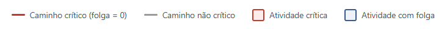

# Rede PERT/CPM do Projeto

Diagrama de rede AON (Activity-on-Node) com cálculo de datas cedo/tarde, folgas e caminho crítico.

```math
\begin{array}{|c|c|c|}
\hline \text{Atividade} & \text{Precedência} & \text{Duração (meses)}\\ 
\hline A&-&1\\
\hline B&-&2\\
\hline C&A&3\\
\hline D&B&4\\
\hline E&B&5\\
\hline F&B&6\\
\hline G&B&5\\
\hline H&D&4\\
\hline I&F&3\\
\hline J&G&2\\
\hline K&H&1\\
\hline L&D,E&2\\
\hline M&G,I&3\\
\hline N&J&4\\
\hline O&C,K&5\\
\hline
\end{array}
```

## 1. Rede AON (Activity-on-Node)

<br>
<br>
Cada nó traz: <b>ES</b> (início mais cedo), <b>EF</b> (fim mais cedo), <b>LS</b> (início mais tarde), <b>LF</b> (fim mais tarde) e a folga (LS − ES). Atividades com folga = 0 formam o caminho crítico.

## 2. Tabela de Cálculo (CPM)

```math
\begin{array}{|c|c|c|c|c|c|c|c|c|}
\hline \text{Atividade} & \text{Precedência} & \text{Duração (meses)} & \text{ES} & \text{EF} & \text{LS} & \text{LF} & \text{Folga} & \text{crítica?}\\ 
\hline A&1&-----&0&1&7&8&7&Não\\
\hline B&2&-----&0&2&0&2&0&Sim\\
\hline C&3&A&1&4&8&11&7&Não\\
\hline D&4&B&2&6&2&6&0&Sim\\
\hline E&5&B&2&7&9&14&7&Não\\
\hline F&6&B&2&8&4&10&2&Não\\
\hline G&5&B&2&7&5&10&3&Não\\
\hline H&4&D&6&10&6&10&0&Sim\\
\hline I&3&F&8&11&10&13&2&Não\\
\hline J&2&G&7&9&10&12&3&Não\\
\hline K&1&H&10&11&10&11&0&Sim\\
\hline L&2&D,E&7&9&14&16&7&Não\\
\hline M&3&G,I&11&14&13&16&2&Não\\
\hline N&4&J&9&13&12&16&3&Não\\
\hline O&5&C,K&11&16&11&16&0&Sim\\
\hline
\end{array}
```

## 3. Como o cálculo foi feito

<p><b>Passagem de avanço (forward pass)</b> — calcula ES e EF de cada atividade:</p>
<ul>
  <li>ES de uma atividade = maior EF entre todas as suas predecessoras (0 se não tiver predecessora);</li>
  <li>EF = ES + duração da atividade.</li>
</ul>
<p><b>Passagem de retorno (backward pass)</b> — calcula LS e LF, partindo da duração total do projeto (16 meses):</p>
<ul>
  <li>LF de uma atividade = menor LS entre todas as suas sucessoras (igual à duração do projeto se não tiver sucessora);</li>
  <li>LS = LF − duração da atividade.</li>
</ul>
<p><b>Folga (slack)</b> = LS − ES (ou LF − EF). Atividades com folga igual a zero não podem atrasar sem atrasar o projeto inteiro — são as atividades <b>críticas</b>, e a sequência delas forma o <b>caminho crítico</b>.</p>

## 4. Caminho Crítico

O caminho crítico do projeto é:

$B(2) \Rightarrow D(4) \Rightarrow H(4) \Rightarrow K(1) \Rightarrow O(5) = \text{16 meses}$

Todas as demais atividades (A, C, E, F, G, I, J, L, M, N) possuem folga e podem, dentro do limite indicado na tabela, atrasar sem comprometer o prazo final de 16 meses — desde que essa folga não seja excedida.


# Rede PERT/CPM — Método Americano (AOA)

Diagrama Activity-on-Arrow (atividade-na-seta), com eventos numerados, atividades fictícias (dummies) e comparação com o método francês (AON).

## 1. Rede AOA (Activity-on-Arrow)

<br>

Cada evento (círculo) é dividido em três campos: <b>número do evento</b> (esquerda), <b>TE</b> — tempo mais cedo (canto superior direito) e <b>TL</b> — tempo mais tarde (canto inferior direito). As setas tracejadas são atividades fictícias (dummies), com duração zero, usadas apenas para preservar a lógica de precedência.

## 2. Por que precisamos de dummies aqui

<ul>
  <li><b>Evento 7 (tail de L):</b> a atividade L depende de D <i>e</i> E. Como H depende só de D, o evento 4 (fim de D) não pode ser o mesmo evento que "libera" L — então a atividade E chega diretamente ao evento 7, e uma dummy parte do evento 4 (fim de D) até o evento 7, garantindo que L só comece quando D <i>e</i> E estiverem prontas.</li>
  <li><b>Evento 8 (tail de M):</b> mesma lógica — M depende de G <i>e</i> I. J depende só de G, então G não pode "liberar" M sozinho. A atividade I chega direto ao evento 8, e uma dummy parte do evento 5 (fim de G) até o evento 8.</li>
  <li><b>Evento 11 (tail de O):</b> como nem C nem K alimentam mais nenhuma outra atividade, elas convergem diretamente no mesmo evento — <b>não é necessária dummy aqui</b>.</li>
  <li><b>Dummies finais (12→16, 13→16, 14→16, 15→16):</b> usadas apenas para unificar as quatro atividades "fim de rede" (L, M, N, O) em um único evento de término do projeto, permitindo ler a duração total em um só lugar.</li>
</ul>

## 3. Tabela de Tempos dos Eventos

```math
\begin{array}{|c|c|c|c|c|c|}
\hline \text{Evento} & \text{Significado} & \text{TE} & \text{TL} & \text{Folga} & \text{Crítico?}\\ 
\hline 1&\text{Início do projeto}&0&0&0&Sim\\
\hline 2&\text{Fim de A}&1&8&7&Não\\
\hline 3&\text{Fim de B}&2&2&0&Sim\\
\hline 4&\text{Fim de D}&6&6&0&Sim\\
\hline 5&\text{Fim de G}&7&10&3&Não\\
\hline 6&\text{Fim de F}&8&10&2&Não\\
\hline 7&\text{Convergência D+E (início de L)}&7&14&7&Não\\
\hline 8&\text{Convergência G+I (início de M)}&11&13&2&Não\\
\hline 9&\text{Fim de H}&10&10&0&Sim\\
\hline 10&\text{Fim de J}&9&12&3&Não\\
\hline 11&\text{Convergência C+K (início de O)}&11&11&0&Sim\\
\hline 12&\text{Fim de L}&9&16&7&Não\\
\hline 13&\text{Fim de M}&14&16&2&Não\\
\hline 14&\text{Fim de N}&13&16&3&Não\\
\hline 15&\text{Fim de O}&16&16&0&Sim\\
\hline 16&\text{Fim do projeto}&16&16&0&Sim\\
\hline
\end{array}
```

Duração total do projeto: <b>16 meses</b> — mesmo resultado do método AON, pelo caminho crítico $1 \Rightarrow 3 \Rightarrow 4 \Rightarrow 9 \Rightarrow 11 \Rightarrow 15 (atividades) B \Rightarrow D \Rightarrow H \Rightarrow K \Rightarrow O$


## 4. Comparação entre os Métodos

<table>
  <tr><th>Aspecto</th><th>Método Francês (AON)</th><th>Método Americano (AOA)</th></tr>
  <tr><td style='text-align:left;font-weight:600;'>Duração total do projeto</td><td>16 meses</td><td>16 meses</td></tr>
<tr><td style='text-align:left;font-weight:600;'>Caminho crítico (atividades)</td><td>B → D → H → K → O</td><td>B → D → H → K → O</td></tr>
<tr><td style='text-align:left;font-weight:600;'>Nº de elementos no diagrama</td><td>15 nós (uma caixa por atividade)</td><td>16 eventos + 15 atividades + 6 dummies</td></tr>
<tr><td style='text-align:left;font-weight:600;'>Precisa de atividades fictícias?</td><td>Não</td><td>Sim (para representar corretamente L e M, mais 4 dummies de fechamento)</td></tr>
<tr><td style='text-align:left;font-weight:600;'>Onde ficam ES/EF/LS/LF</td><td>Dentro da própria caixa da atividade</td><td>Distribuídos entre os eventos (TE/TL) que a atividade conecta</td></tr>
</table>

## 5. Conclusão

Como esperado, os dois métodos chegam exatamente ao <b>mesmo resultado numérico</b>: duração total de <b>16 meses</b> e o mesmo caminho crítico, formado pelas atividades <b>B, D, H, K e O</b>. Isso confirma que AON e AOA são apenas <b>duas convenções gráficas diferentes</b> para representar a mesma lógica de precedência e os mesmos cálculos de CPM — a escolha entre elas é basicamente uma questão de preferência de notação (ou de exigência da disciplina/norma), não uma diferença de resultado. A principal diferença prática está no <b>método americano exigir atividades fictícias (dummies)</b> sempre que duas atividades compartilham parcialmente as mesmas predecessoras, o que deixa o diagrama AOA mais denso e mais sujeito a erros de construção do que o AON.
