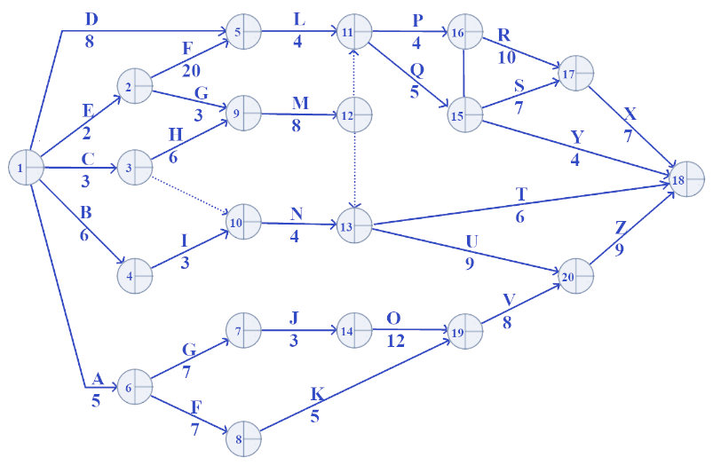
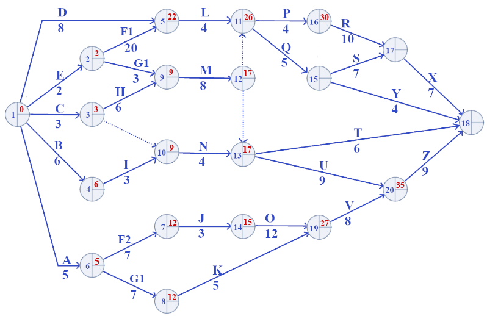
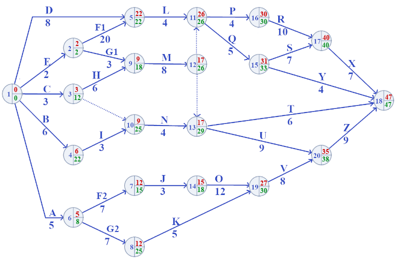

# Rede CPM - Exercício proposto 3

1. Calcular as datas cedo e datas tarde dos eventos
2. Calcular as folgas livres e totais
3. Indicar o caminho crítico
4. Elaborar o cronograma integrado

### Data Cedo e Data Tarde

| Nó | Data Cedo | Data Tarde | Nó | Data Cedo | Data Tarde |
|---|---|---|---|---|---|
|1	|0 | 0 |2	|2	|2|
|3	|3	|12|4	|6	|22|
|5	|22	|22|6	|5	|8|
|7	|12	|15|8	|12	|25|
|9	|9	|18|10	|9	|25|
|11	|26	|26|12	|17	|26|
|13	|17	|29|14	|15	|18|
|15	|31	|33|16	|30	|30|
|17	|40	|40|18	|47	|47|
|19	|27	|30|20	|35	|38|

