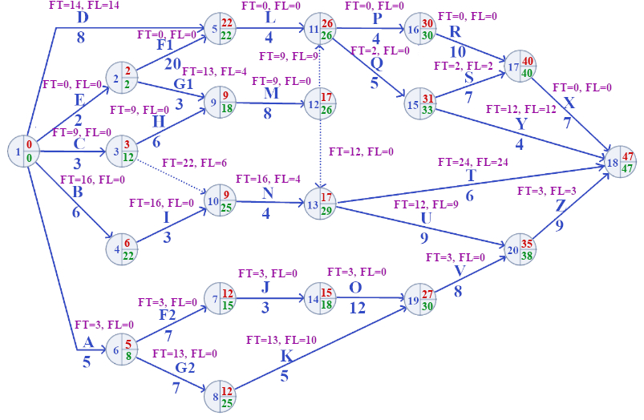
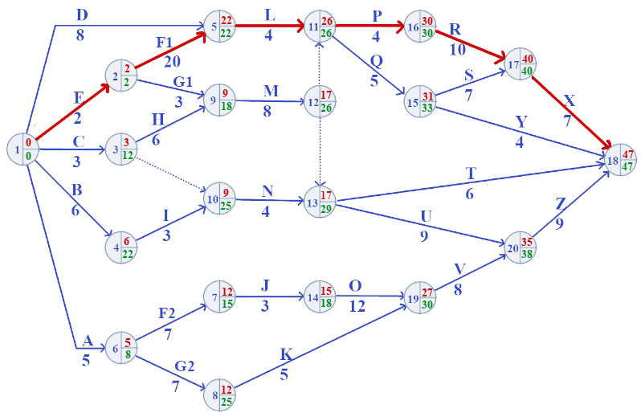
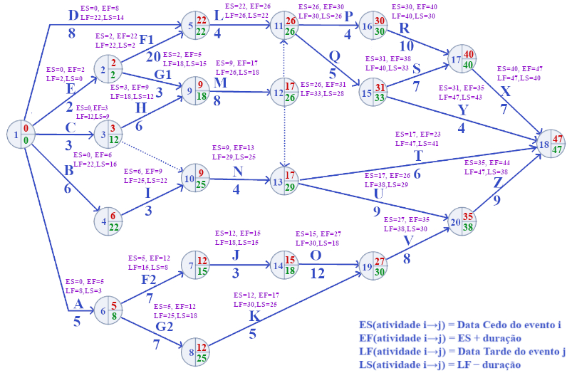

# Rede CPM - Exercício proposto 3

1. Calcular as datas cedo e datas tarde dos eventos
2. Calcular as folgas livres e totais
3. Indicar o caminho crítico
4. Elaborar o cronograma integrado

### Data Cedo (DC) e Data Tarde (DT)

| Nó | Data Cedo | Data Tarde | Nó | Data Cedo | Data Tarde |
|---|---|---|---|---|---|
|1	|0 | 0 |2	|2	|2|
|3	|3	|12|4	|6	|22|
|5	|22	|22|6	|5	|8|
|7	|12	|15|8	|12	|25|
|9	|9	|18|10	|9	|25|
|11	|26	|26|12	|17	|26|
|13	|17	|29|14	|15	|18|
|15	|31	|33|16	|30	|30|
|17	|40	|40|18	|47	|47|
|19	|27	|30|20	|35	|38|

### Folga Total (FT) e Folga Livre (FL)

### Caminho Crítico

### ES, EF, LF e LS

| Ativ. | De→Para | Dur. | ES | EF | LS | LF | TF | FF |
|---|---|---|---|---|---|---|---|---|
| A | 1→6 | 5 | 0 | 5 | 3 | 8 | 3 | 0 |
| B | 1→4 | 6 | 0 | 6 | 16 | 22 | 16 | 0 |
| C | 1→3 | 3 | 0 | 3 | 9 | 12 | 9 | 0 |
| D | 1→5 | 8 | 0 | 8 | 14 | 22 | 14 | 14 |
| E | 1→2 | 2 | 0 | 2 | 0 | 2 | **0** | 0 |
| F1 | 2→5 | 20 | 2 | 22 | 2 | 22 | **0** | 0 |
| F2 | 6→8 | 7 | 5 | 12 | 18 | 25 | 13 | 0 |
| G1 | 2→9 | 3 | 2 | 5 | 15 | 18 | 13 | 4 |
| G2 | 6→7 | 7 | 5 | 12 | 8 | 15 | 3 | 0 |
| H | 3→9 | 6 | 3 | 9 | 12 | 18 | 9 | 0 |
| I | 4→10 | 3 | 6 | 9 | 22 | 25 | 16 | 0 |
| J | 7→14 | 3 | 12 | 15 | 15 | 18 | 3 | 0 |
| K | 8→19 | 5 | 12 | 17 | 25 | 30 | 13 | 10 |
| L | 5→11 | 4 | 22 | 26 | 22 | 26 | **0** | 0 |
| M | 9→12 | 8 | 9 | 17 | 18 | 26 | 9 | 0 |
| N | 10→13 | 4 | 9 | 13 | 25 | 29 | 16 | 4 |
| O | 14→19 | 12 | 15 | 27 | 18 | 30 | 3 | 0 |
| P | 11→16 | 4 | 26 | 30 | 26 | 30 | **0** | 0 |
| Q | 11→15 | 5 | 26 | 31 | 28 | 33 | 2 | 0 |
| R | 16→17 | 10 | 30 | 40 | 30 | 40 | **0** | 0 |
| S | 15→17 | 7 | 31 | 38 | 33 | 40 | 2 | 2 |
| T | 13→18 | 6 | 17 | 23 | 41 | 47 | 24 | 24 |
| U | 13→20 | 9 | 17 | 26 | 29 | 38 | 12 | 9 |
| V | 19→20 | 8 | 27 | 35 | 30 | 38 | 3 | 0 |
| X | 17→18 | 7 | 40 | 47 | 40 | 47 | **0** | 0 |
| Y | 15→18 | 4 | 31 | 35 | 43 | 47 | 12 | 12 |
| Z | 20→18 | 9 | 35 | 44 | 38 | 47 | 3 | 3 |
| dummy 1 | 3→10 | 0 | 3 | 3 | 25 | 25 | 22 | 6 |
| dummy 2 | 12→11 | 0 | 17 | 17 | 26 | 26 | 9 | 9 |
| dummy 3 | 12→13 | 0 | 17 | 17 | 29 | 29 | 12 | 0 |

**Caminho crítico (TF = 0):** E → F1 → L → P → R → X, duração total = **47**

### Cronograma integrado

Agora cada barra tem três segmentos visuais:

- **Bloco sólido (laranja ou azul):** a duração real da atividade, de ES a EF.
- **Bloco verde:** a folga livre (FF) — o quanto a atividade pode atrasar sem empurrar a data cedo de nenhuma atividade sucessora.
- **Bloco cinza:** o restante da folga total (TF − FF) — a folga adicional que existe na rede, mas que, se consumida, atrasaria o início mais cedo de sucessoras (mesmo sem atrasar o projeto todo).

**Como ler:**
- Atividades críticas (E, F1, L, P, R, X) aparecem só com o bloco sólido laranja — sem folga nenhuma, TF = FF = 0.
- **T (13→18)** é o exemplo mais visível de folga total grande (24 dias) e ela é toda folga livre (FF = TF = 24) — pode deslizar livremente sem afetar ninguém.
- **N (10→13)** mostra os dois tipos: 4 dias de folga livre (verde) + 12 dias de folga total adicional (cinza) que dependem do caminho via nó 13.
- **D (1→5)** tem TF = FF = 14 — toda a folga é livre, então o bloco cinza é zero ali.