<h1>Simulação de Processo de Fresagem</h1>

<h3>Peça 1</h4>

Ao abrir imagem mostrada na Figura 1 no Autodesk Fusion 360, trabalharemos no Espaço de Trabalho de Manufatura (opção no canto superior esquerdo). O primeiro passo é definir uma nova configuração, na aba Fresagem => Configuração => Nova configuração.

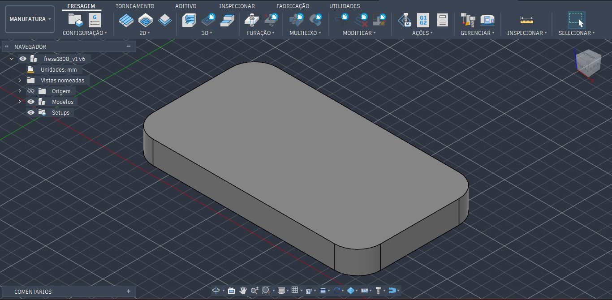

<i>Figura 1</i>

<h3>Configuração</h3>
Uma janela será aberta no lado direito, contendo três abas: Configuração, Bloco e Pós-Processar. Trabalharemos apenas com os dois primeiros. Logo no início, um envólucro transparente envolverá a peça, e em suas arestas e faces laterais aparecerão pontos brancos, e o eixo de coordenadas poderá aparecer no meio da peça. Como é uma fresa, o eixo Z deverá apontar para o eixo vertical, enquanto que o eixo X e Y formarão um plano horizontal. O eixo de coordenadas deverá ser deslocado para um dos extremos do envólucro, onde será nosso ponto zero.

Na aba Configuração, optaremos pelos seguintes valores (na ordem que faremos a configuração):

- Configuração => Tipo de operação: Fresamento
- Sistema de coordenadas de trabalho (WCS) => Orientação => Plano/eixo Z e eixo X (são os eixos de referência para nosso trabalho de fresagem) 
- Sistema de coordenadas de trabalho (WCS) => Eixo Z: Selecionar => Seleciono um face perpendicular do envólucro, ou da peça, em relação ao eixo Z, ou um aresta paralela ao eixo Z. 
- Sistema de coordenadas de trabalho (WCS) => Inverter eixo Z: seleciono caso a direção do eixo Z apontar para o sentido contrário. 
- Sistema de coordenadas de trabalho (WCS) => Eixo X: Selecionar => Seleciono um face perpendicular do envólucro, ou da peça, em relação ao eixo X, ou um aresta paralela ao eixo X. 
- Sistema de coordenadas de trabalho (WCS) => Inverter eixo X: seleciono caso a direção do eixo X apontar para o sentido contrário.
- Sistema de coordenadas de trabalho (WCS) => Origem => Ponto de caixa do bloco
- Sistema de coordenadas de trabalho (WCS) => Ponto do bloco =>  Ponto da caixa => Seleciono o extremo esquerdo superior do envólucro, que deslocará o eixo de coordenadas para aquele ponto.

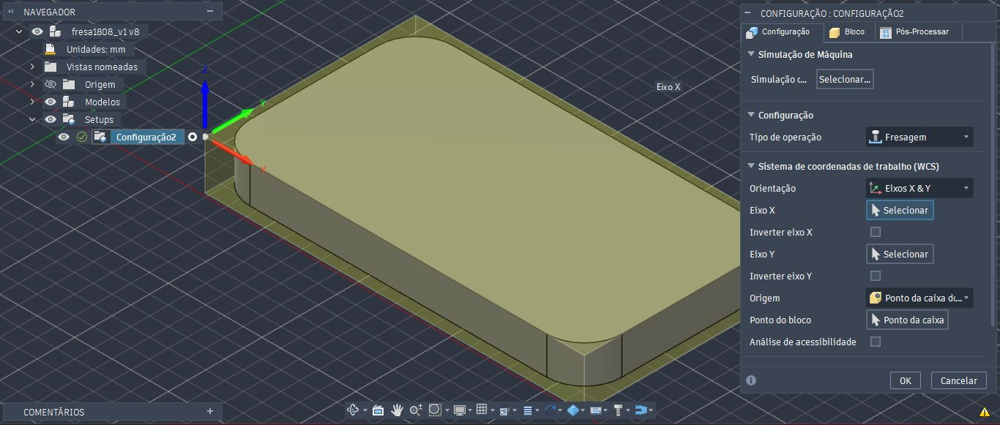

<i>Figura 2: Ambiente de configuração</i>

Na aba Bloco, na configuração em Modo, há duas opções de envólucros que se encaixam em nossa peça: "Caixa de tamanho relativo" e "Caixa de tamanho fixo". Em Caixa de tamanho fixo, partimos com os valores dimensionais extremos da peça acabada como referência. Note que as dimensões do modelo, abaixo da janela, são as mesmas e prontas para redimensionar com os valores das dimensões da peça bruta a ser posicionada na fresa.  

Para fins didáticos, adicionaremos 4mm a mais de Largura (X) e Profundidade (Y). Para Altura (Z), adicionaremos 10mm pois precisamos que a base tenha uma altura suficiente para que a peça seja serrada após concluir a fresagem. Na Posição do modelo, abaixo de Altura (Z), optaremos por "Deslocamento superior (+Z)". Esta opção permitirá que eu controle o deslocamento acima da face superior da peça, permitindo o facejamento, e além disso, deixamos uma sobra abaixo da face inferior para fixação e descarte do material excedente.

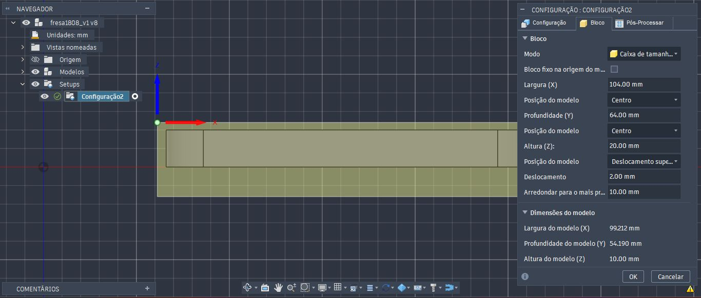

<i>Figura 3: configuração em Bloco</i>

<h3>Faceamento</h3>

Habilitamos o processo através da opção Face, na aba Fresagem => 2D. Será aberto uma janela no lado direito, chamado Face, que possui 6 abas: Ferramenta, Multieixo, Geometria, Planos de trabalho, Passo e Vincular. 

Na aba Ferramentas, escolheremos a ferramenta de fresagem, em Ferramenta => Selecionar. Uma outra janela será aberta, com diversas Bibliotecas do Fusion. Optaremos pelas Ferramentas de Fresagem (métrico) => Ø10mm (10mm Flat Endmill). Caso a biblioteca esteja desativada, basta Ativar Biblioteca, e as opções com todas as ferramentas de Fresagem serão listadas.

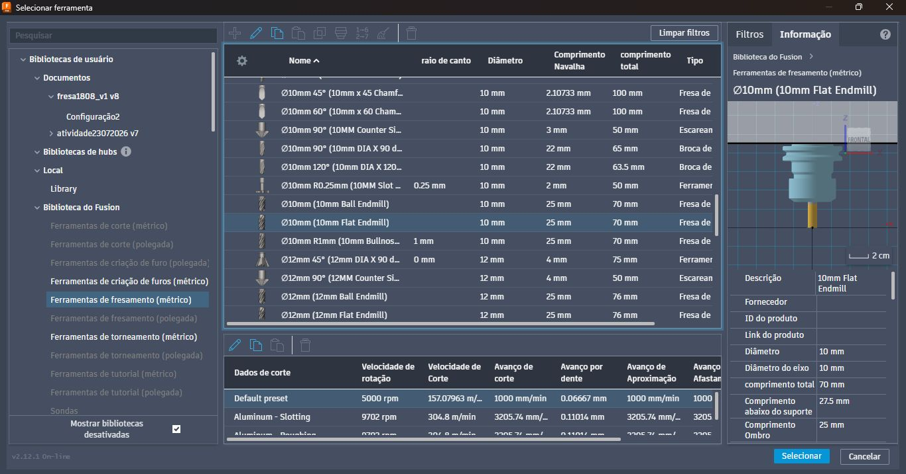

<i>Figura 4: configuração de Faceamento</i>

Na aba Passos, habilitamos Passagens Múltiplas. Esta opção permite determinar um incremento máximo, ou seja, a profundidade que a ferramenta fará o faceamento, em relação eo eixo z, para cada passo. Se há 2mm de profundidade, e estabelecermos 1mm de incremento máximo, a ferramenta fará duas etapas de faceamento, no intervalo de 1mm. Adicionaremos 1mm em Deslocamento do bloco, garantindo que toda a superfície seja faceada.

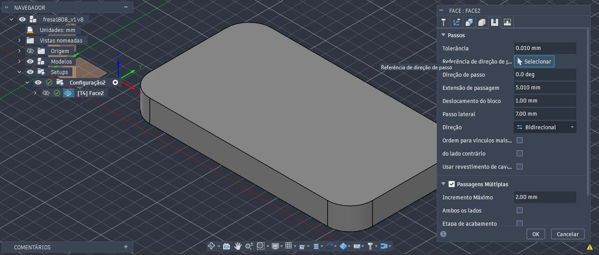

<i>Figura 5: configuração em Passos</i>

Note que o caminho ficará visível por onde a ferramenta irá fazer o faceamento.

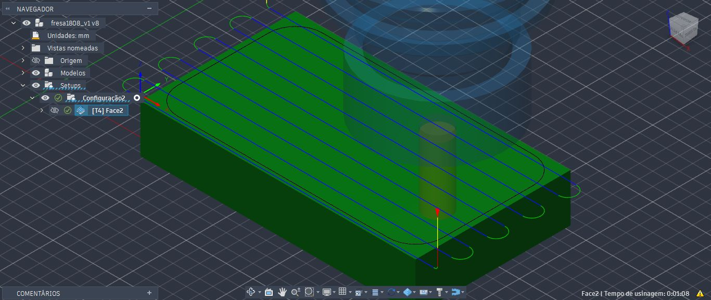

<i>Figura 6: caminho por onde a ferramenta percorrerá pela superfície do bloco</i>

Ao executar a simulação, devemos localizar o item Navegador => Setups => Configuração. Clique com o botão direito sobre a Configuração, e selecione Simular. Se tudo estiver correto, a ferramenta fará os movimentos de Faceamento. Ao concluir a simulação, a área faceada mudará de cor.

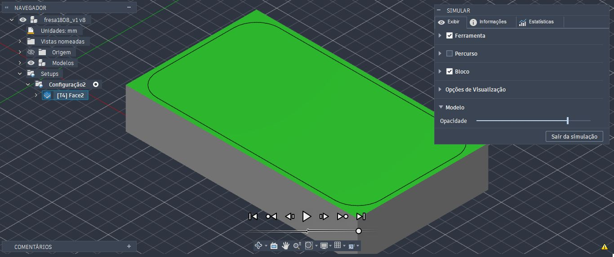

<i>Figura 7: Simulação para Faceamento</i>

<h3>Contorno 2D</h3>

O processo para remoção do contorno da peça seguem passos parecidos com a que realizamos para o faceamento. Selecionamos o processo para remover os contornos através da aba Fresagem => 2D => Contorno 2D. Escolheremos uma ferramenta desta vez com um diâmetro menor, já que iremos apenas remover contornos externos da peça bruta.

Na aba Geometria, em Seleção de contorno => Selecionar, devemos selecionar a borda inferior do plano. Note que uma seta vermelha aparecerá paralelo à aresta inferior. 

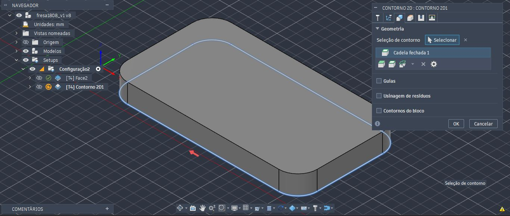

<i>Figura 8: Configuração em Geometria</i>

Na aba Planos de trabalho, as opções indicando "Topo do bloco" devem ser alteradas para "Topo do modelo", porque o faceamento já foi executado, eliminando os 2mm da parte superior. Assim a ferramenta partirá da posição onde está sinalizado na linha azul (Deslocamento superior), ou seja, alinhado a superfície faceada.

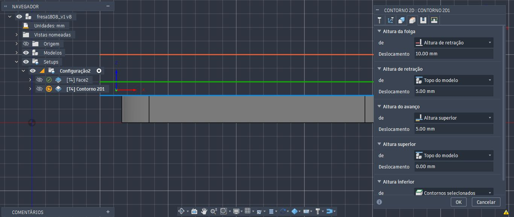

<i>Figura 9: configuração para Planos de trabalho</i>

Na aba Passos, habilitaremos a opção Passagens Múltiplas. O passo vertical máximo indicaremos 4.0 mm, com 4 passos verticais, e 2.00 mm de passo vertical de acabamento. Como a ferramenta possui um diâmetro pequeno, pode ocorrer desgaste ao realizar o desbaste lateral, danificando-a.

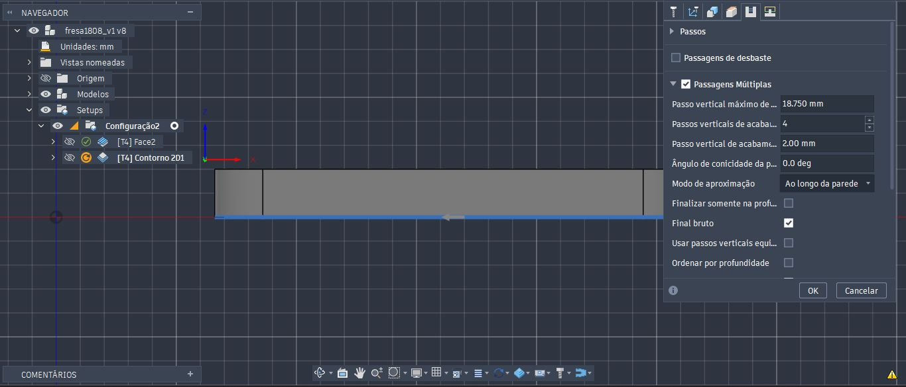

<i>Figura 10: Configuração em Passos</i>

Ao realizar a simulação, o contorno externo será removido.

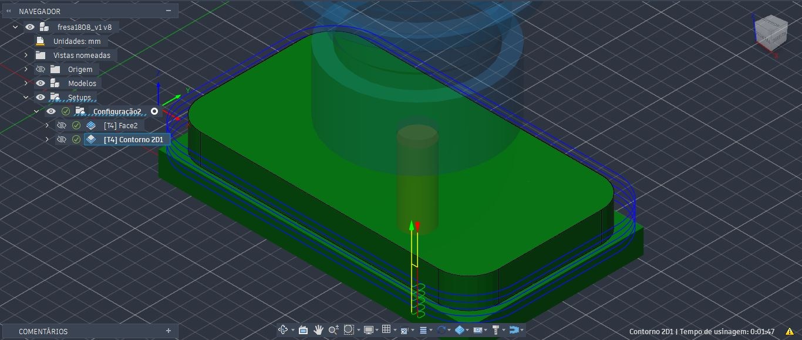
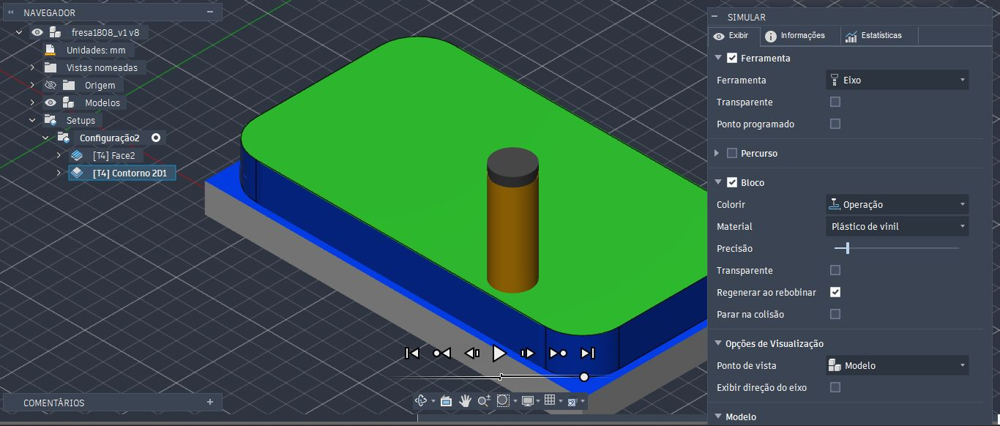

<i>Figura 11 e 12: Simulação para Contorno 2D</i>

