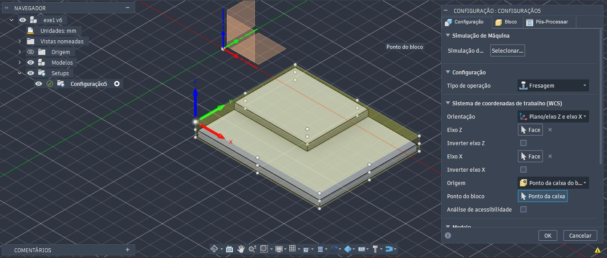

<h1>Simulação de Processo de Fresagem</h1>

<h3>Peça 1</h4>

Ao abrir a Figura no Autodesk Fusion 360, trabalharemos no Espaço de Trabalho de Manufatura (opção no canto superior esquerdo). O primeiro passo é definir uma nova configuração, na aba Fresagem => Configuração => Nova configuração.

<h4>Configuração</h4>
Uma janela será aberta no lado direito, contendo três abas: Configuração, Bloco e Pós-Processar. Trabalharemos apenas com os dois primeiros. Logo no início, um envólucro transparente envolverá a peça, e em suas arestas e faces laterais aparecerão pontos brancos, e o eixo de coordenadas poderá aparecer no meio da peça. Como é uma fresa, o eixo Z deverá apontar para o eixo vertical, enquanto que o eixo X e Y formarão um plano horizontal. O eixo de coordenadas deverá ser deslocado para um dos extremos do envólucro, onde será nosso ponto zero.

Na aba Configuração, optaremos pelos seguintes valores (na ordem que faremos a configuração):

- Configuração => Tipo de operação: Fresamento
- Sistema de coordenadas de trabalho (WCS) => Orientação => Plano/eixo Z e eixo X (são os eixos de referência para nosso trabalho de fresagem) 
- Sistema de coordenadas de trabalho (WCS) => Eixo Z: Selecionar => Seleciono um face perpendicular do envólucro, ou da peça, em relação ao eixo Z, ou um aresta paralela ao eixo Z. 
- Sistema de coordenadas de trabalho (WCS) => Inverter eixo Z: seleciono caso a direção do eixo Z apontar para o sentido contrário. 
- Sistema de coordenadas de trabalho (WCS) => Eixo X: Selecionar => Seleciono um face perpendicular do envólucro, ou da peça, em relação ao eixo X, ou um aresta paralela ao eixo X. 
- Sistema de coordenadas de trabalho (WCS) => Inverter eixo X: seleciono caso a direção do eixo X apontar para o sentido contrário.
- Sistema de coordenadas de trabalho (WCS) => Origem => Ponto de caixa do bloco
- Sistema de coordenadas de trabalho (WCS) => Ponto do bloco =>  Ponto da caixa => Seleciono o extremo esquerdo superior do envólucro, que deslocará o eixo de coordenadas para aquele ponto.

Na aba Bloco, na configuração em Modo, há duas opções de envólucros que se encaixam em nossa peça: "Caixa de tamanho relativo" e "Caixa de tamanho fixo". Se optarmos pelo tamanho relativo, os valores para ajustes de deslocamento lateral, superior e inferior serão adicionados proporcionalmente para cada dimensão, respectivamente. Por um lado distribui as dimensões, por outro não temos um controle real das dimensões quando colocarmos em prática no equipamento uma peça bruta, e executar a tarefa de fresamento.

Em Caixa de tamanho fixo, partimos com os valores dimensionais extremos da peça acabada como referência. Note que as dimensões do modelo, abaixo da janela, são as mesmas e prontas para redimensionar com os valores das dimensões da peça bruta a ser posicionada na fresa.  

Para fins didáticos, adicionaremos 4mm a mais de Largura (X) e Profundidade (Y). Para Altura (Z), adicionaremos 10mm pois precisamos que a base tenha uma altura suficiente para que a peça seja serrada após concluir a fresagem. Na Posição do modelo, abaixo de Altura (Z), optaremos por "Deslocamento superior (+Z)". Esta opção permitirá que eu controle o deslocamento acima da face superior da peça, permitindo o facejamento, e além disso, deixamos uma sobra abaixo da face inferior para fixação e descarte do material excedente.

<h4>Face</h4>

Na aba 2D, clique em Face. Ao abrir a janela Face, deve-se escolher a Ferramenta, em "Selecionar...". Nas Bilbiotecas de usuário -> Biblioteca do Fusion, opte por "Ferramentas de fresamento (métrico)". Ative a Biblioteca, e escolha ∅10mm (10mm Flat Endmill). Podemos também experimentar ∅20mm (20mm Flat Endmill).  

Em Geometria, em Contornos do bloco -> Seleções de bloco, selecione a base inferior da peça.  

Em Planos de trabalho, podemos ver no plano frontal, 4 linhas acima da peça: Deslocamento da altura da folga (vermelho), Deslocamento da altura do avanço (verde), Deslocamento superior (azul claro), Offset ao fundo (azul escuro). Mantenha as configurações como mostrado.

Em Passos, selecione Passagens Múltiplas.

Ao final da configuração, deve-se visualizar as seguintes imagens: com a ferramenta ∅10mm (10mm Flat Endmill) e ∅20mm (20mm Flat Endmill). Cada uma posicionada e o caminho que ela irá percorrer.

Ao simular, obtemos o faceamento executado na peça.

<b>Obs.:</b> Repare que as vezes o facejamento deixa alguma borda em um dos lados, após a ferramenta executar a tarefa. 

Pode-se ajustar em Passos -> Deslocamento do Bloco, e configurar com alguns mm além do limite do bloco. Deve-se considerar se, ao ultrapassar o limite, não afetará outras áreas da peça que serão trabalhadas, ou já finalizadas. 

 

<h4>Contorno 2D</h4>

Na aba 2D, clique em Contorno 2D. Ao abrir a janela Face, deve-se escolher a Ferramenta, em "Selecionar...". Nas Bilbiotecas de usuário -> Biblioteca do Fusion, opte por "Ferramentas de fresamento (métrico)". Ative a Biblioteca, e escolha ∅25mm (25mm Flat Endmill). Em Geometria, faça o mesmo que em Face. Em Planos de Trabalho, a Altura superior configuramos para -2.00 mm.

Em Passos -> Passagens Múltiplas, coloque 4 para Passos verticais de acabamento, e 4.00mm para Passo vertical de acabamento.

Antes da simulação, podemos ver o caminho que a ferramenta caminhará. Concluíndo a simulação, temos a peça desbastada. Note que aplicamos a simulação em "Configuração1", executando o faceamento e o desbaste da peça.

