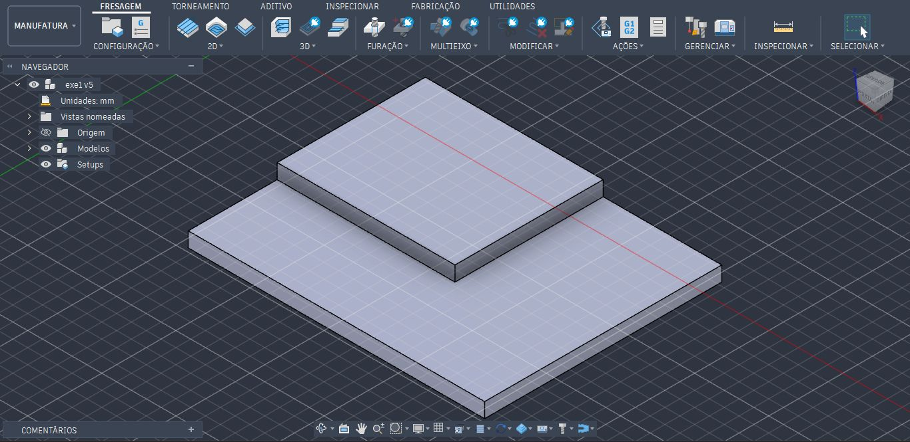
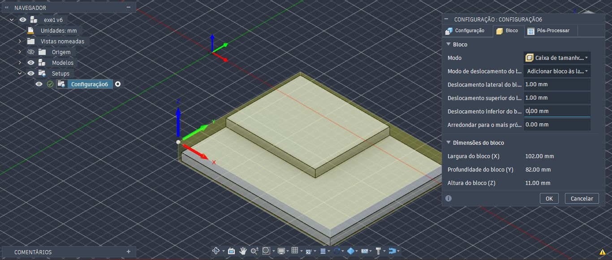
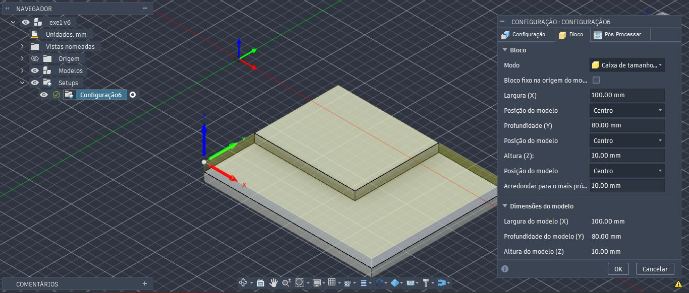
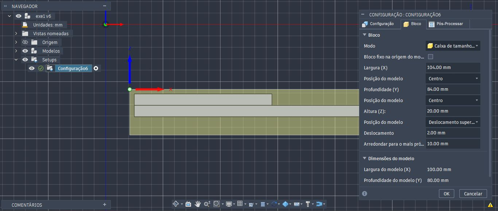

<h1>Simulação de Processo de Fresagem</h1>

<h3>Peça 2</h4>

Ao abrir o arquivo da Figura 1 no Autodesk Fusion 360, trabalharemos no Espaço de Trabalho de Manufatura (opção no canto superior esquerdo). O primeiro passo é definir uma nova configuração, na aba Fresagem => Configuração => Nova configuração.

<i>Figura 1: Peça para fresagem</i>

<h3>Configuração</h3>
Uma janela será aberta no lado direito, contendo três abas: Configuração, Bloco e Pós-Processar. Trabalharemos apenas com os dois primeiros. Logo no início, um envólucro transparente envolverá a peça, e em suas arestas e faces laterais aparecerão pontos brancos, e o eixo de coordenadas poderá aparecer no meio da peça. Como é uma fresa, o eixo Z deverá apontar para o eixo vertical, enquanto que o eixo X e Y formarão um plano horizontal. O eixo de coordenadas deverá ser deslocado para um dos extremos do envólucro, onde será nosso ponto zero.

Na aba Configuração, optaremos pelos seguintes valores (na ordem que faremos a configuração):

- Configuração => Tipo de operação: Fresamento
- Sistema de coordenadas de trabalho (WCS) => Orientação => Plano/eixo Z e eixo X (são os eixos de referência para nosso trabalho de fresagem) 
- Sistema de coordenadas de trabalho (WCS) => Eixo Z: Selecionar => Seleciono um face perpendicular do envólucro, ou da peça, em relação ao eixo Z, ou um aresta paralela ao eixo Z. 
- Sistema de coordenadas de trabalho (WCS) => Inverter eixo Z: seleciono caso a direção do eixo Z apontar para o sentido contrário. 
- Sistema de coordenadas de trabalho (WCS) => Eixo X: Selecionar => Seleciono um face perpendicular do envólucro, ou da peça, em relação ao eixo X, ou um aresta paralela ao eixo X. 
- Sistema de coordenadas de trabalho (WCS) => Inverter eixo X: seleciono caso a direção do eixo X apontar para o sentido contrário.
- Sistema de coordenadas de trabalho (WCS) => Origem => Ponto de caixa do bloco
- Sistema de coordenadas de trabalho (WCS) => Ponto do bloco =>  Ponto da caixa => Seleciono o extremo esquerdo superior do envólucro, que deslocará o eixo de coordenadas para aquele ponto.

<i>Figura 2: Ambiente de configuração</i>

Na aba Bloco, na configuração em Modo, há duas opções de envólucros que se encaixam em nossa peça: "Caixa de tamanho relativo" e "Caixa de tamanho fixo". Se optarmos pelo tamanho relativo, os valores para ajustes de deslocamento lateral, superior e inferior serão adicionados proporcionalmente para cada dimensão, respectivamente. Por um lado distribui as dimensões, por outro não temos um controle real das dimensões quando colocarmos em prática no equipamento uma peça bruta, e executar a tarefa de fresamento.

<i>Figura 3: Ambiente de configuração, em bloco, para caixa de tamanho relativo</i>

Em Caixa de tamanho fixo, partimos com os valores dimensionais extremos da peça acabada como referência. Note que as dimensões do modelo, abaixo da janela, são as mesmas e prontas para redimensionar com os valores das dimensões da peça bruta a ser posicionada na fresa.  

<i>Figura 4: Ambiente de configuração, em bloco, para caixa de tamanho fixo</i>

Para fins didáticos, adicionaremos 4mm a mais de Largura (X) e Profundidade (Y). Para Altura (Z), adicionaremos 10mm pois precisamos que a base tenha uma altura suficiente para que a peça seja serrada após concluir a fresagem. Na Posição do modelo, abaixo de Altura (Z), optaremos por "Deslocamento superior (+Z)". Esta opção permitirá que eu controle o deslocamento acima da face superior da peça, permitindo o facejamento, e além disso, deixamos uma sobra abaixo da face inferior para fixação e descarte do material excedente.

<i>Figura 5 e 6: Ambiente de configuração, em bloco, para caixa de tamanho fixo</i>

<b>Observações:</b> 
Note que há a opção Arredondamento para o mais próximo. Não iremos alterar este valor, por hora, já que ele fará o arredondamento para cima das dimensões de todo o bloco. Um dos motivos para que ela exista é quando ao adquirir uma matéria prima para realizar a fresagem, ela vem com dimensões específicas para venda, nunca valores quebrados. Portanto, esta opção é útil nessa situação. Para fins didáticos, ela é mais um item a ser conhecido.

Outra opção que não utilizaremos é a opção Bloco fixo na origem do modelo, que desabilitaremos pois o eixo de coordenadas de trabalho que configuramos pode não ser o mesmo que o eixo origem da peça quando foi modelada, e aberta em Projeto.  Se habilitarmos, toda a configuração realizada será deslocada para o eixo origem do Projeto, não da Manufatura.

<h3>Fresagem</h3>

