<h1>Simulação de Processo de Fresagem</h1>

<h3>Peça 2</h4>

Ao abrir o arquivo da Figura 1 no Autodesk Fusion 360, trabalharemos no Espaço de Trabalho de Manufatura (opção no canto superior esquerdo). O primeiro passo é definir uma nova configuração, na aba Fresagem => Configuração => Nova configuração.

<i>Figura 1: Peça para fresagem</i>

<h3>Configuração</h3>
Uma janela será aberta no lado direito, contendo três abas: Configuração, Bloco e Pós-Processar. Trabalharemos apenas com os dois primeiros. Logo no início, um envólucro transparente envolverá a peça, e em suas arestas e faces laterais aparecerão pontos brancos, e o eixo de coordenadas poderá aparecer no meio da peça. Como é uma fresa, o eixo Z deverá apontar para o eixo vertical, enquanto que o eixo X e Y formarão um plano horizontal. O eixo de coordenadas deverá ser deslocado para um dos extremos do envólucro, onde será nosso ponto zero.

Na aba Configuração, optaremos pelos seguintes valores (na ordem que faremos a configuração):

- Configuração => Tipo de operação: Fresamento
- Sistema de coordenadas de trabalho (WCS) => Orientação => Plano/eixo Z e eixo X (são os eixos de referência para nosso trabalho de fresagem) 
- Sistema de coordenadas de trabalho (WCS) => Eixo Z: Selecionar => Seleciono um face perpendicular do envólucro, ou da peça, em relação ao eixo Z, ou um aresta paralela ao eixo Z. 
- Sistema de coordenadas de trabalho (WCS) => Inverter eixo Z: seleciono caso a direção do eixo Z apontar para o sentido contrário. 
- Sistema de coordenadas de trabalho (WCS) => Eixo X: Selecionar => Seleciono um face perpendicular do envólucro, ou da peça, em relação ao eixo X, ou um aresta paralela ao eixo X. 
- Sistema de coordenadas de trabalho (WCS) => Inverter eixo X: seleciono caso a direção do eixo X apontar para o sentido contrário.
- Sistema de coordenadas de trabalho (WCS) => Origem => Ponto de caixa do bloco
- Sistema de coordenadas de trabalho (WCS) => Ponto do bloco =>  Ponto da caixa => Seleciono o extremo esquerdo superior do envólucro, que deslocará o eixo de coordenadas para aquele ponto.

<i>Figura 2: Ambiente de configuração</i>

Na aba Bloco, na configuração em Modo, há duas opções de envólucros que se encaixam em nossa peça: "Caixa de tamanho relativo" e "Caixa de tamanho fixo". Se optarmos pelo tamanho relativo, os valores para ajustes de deslocamento lateral, superior e inferior serão adicionados proporcionalmente para cada dimensão, respectivamente. Por um lado distribui as dimensões, por outro não temos um controle real das dimensões quando colocarmos em prática no equipamento uma peça bruta, e executar a tarefa de fresamento.

<i>Figura 3: Ambiente de configuração, em bloco, para caixa de tamanho relativo</i>

Em Caixa de tamanho fixo, partimos com os valores dimensionais extremos da peça acabada como referência. Note que as dimensões do modelo, abaixo da janela, são as mesmas e prontas para redimensionar com os valores das dimensões da peça bruta a ser posicionada na fresa.  

<i>Figura 4: Ambiente de configuração, em bloco, para caixa de tamanho fixo</i>

Para fins didáticos, adicionaremos 4mm a mais de Largura (X) e Profundidade (Y). Para Altura (Z), adicionaremos 10mm pois precisamos que a base tenha uma altura suficiente para que a peça seja serrada após concluir a fresagem. Na Posição do modelo, abaixo de Altura (Z), optaremos por "Deslocamento superior (+Z)". Esta opção permitirá que eu controle o deslocamento acima da face superior da peça, permitindo o facejamento, e além disso, deixamos uma sobra abaixo da face inferior para fixação e descarte do material excedente.

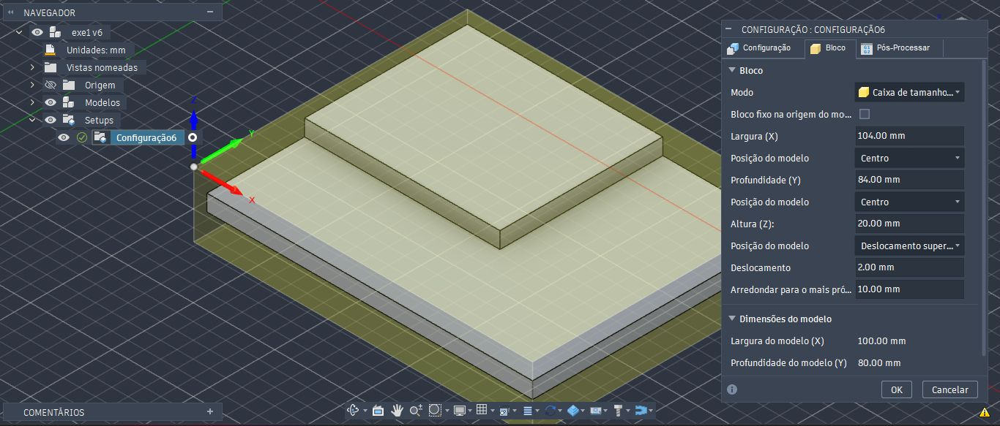

<i>Figura 5 e 6: Ambiente de configuração, em bloco, para caixa de tamanho fixo</i>

<b>Observações:</b> 
Note que há a opção Arredondamento para o mais próximo. Não iremos alterar este valor, por hora, já que ele fará o arredondamento para cima das dimensões de todo o bloco. Um dos motivos para que ela exista é quando ao adquirir uma matéria prima para realizar a fresagem, ela vem com dimensões específicas para venda, nunca valores quebrados. Portanto, esta opção é útil nessa situação. Para fins didáticos, ela é mais um item a ser conhecido.

Outra opção que não utilizaremos é a opção Bloco fixo na origem do modelo, que desabilitaremos pois o eixo de coordenadas de trabalho que configuramos pode não ser o mesmo que o eixo origem da peça quando foi modelada, e aberta em Projeto.  Se habilitarmos, toda a configuração realizada será deslocada para o eixo origem do Projeto, não da Manufatura.

<h3>Faceamento</h3>

Habilitamos o processo através da opção Face, na aba Fresagem => 2D. Será aberto uma janela no lado direito, chamado Face, que possui 6 abas: Ferramenta, Multieixo, Geometria, Planos de trabalho, Passo e Vincular. 

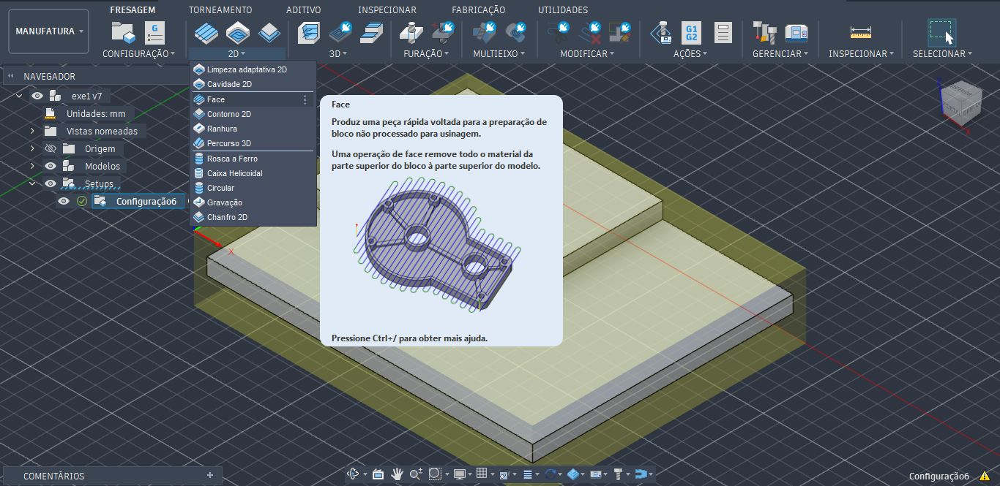
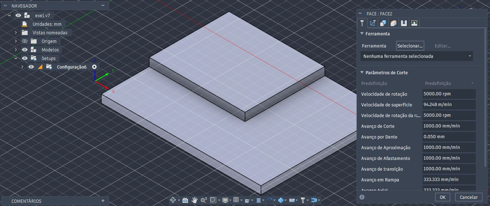

<i>Figura 7 e 8: Caminho para configuração de Faceamento.</i>

Na aba Ferramentas, escolheremos a ferramenta de fresagem, em Ferramenta => Selecionar. Uma outra janela será aberta, com diversas Bibliotecas do Fusion. Optaremos pelas Ferramentas de Fresagem (métrico) => Ø20mm (20mm Flat Endmill). Caso a biblioteca esteja desativada, basta Ativar Biblioteca, e as opções com todas as ferramentas de Fresagem serão listadas.

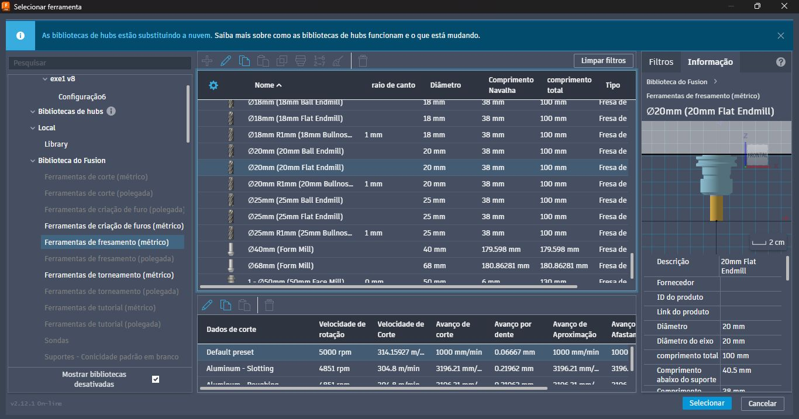

<i>Figura 9: Escolha da ferramenta para Faceamento.</i>

Repare que as informações sobre Parâmetros de corte mudaram após a escolha da ferramenta. Estes parâmetros serão úteis para ajuste quando analisarmos o processo de fresamento, o material a ser trabalhado, etc. Por hora, não alteraremos os valores já que não aplicaremos para um processo real.

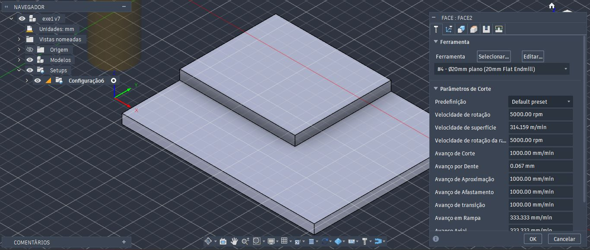

<i>Figura 10: Opção para Parâmetros de corte</i>

Na aba Planos de trabalho, podemos ver no plano frontal, 4 linhas acima da peça: Deslocamento da altura da folga (vermelho), Deslocamento da altura do avanço (verde), Deslocamento superior (azul claro), Offset ao fundo (azul escuro). O deslocamento superior corresponde justamente ao valor de deslocamento (offset) configurado na aba Bloco, em Configuração, indicando onde a superfície do material bruto está posicionado (no caso, 2mm). O deslocamento de altura do avanço é a área onde a ferramenta ficará posicionada antes de começar o faceamento. Não faremos alterações por enquanto.

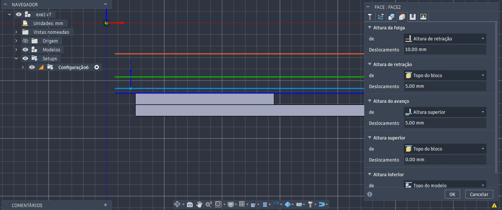

<i>Figura 11: Linhas guias indicadoras dos Planos de trabalho</i>

Na aba Passos, habilitamos Passagens Múltiplas. Elas representam quantas passagens a ferramenta percorrerá, a profundidade, etc.

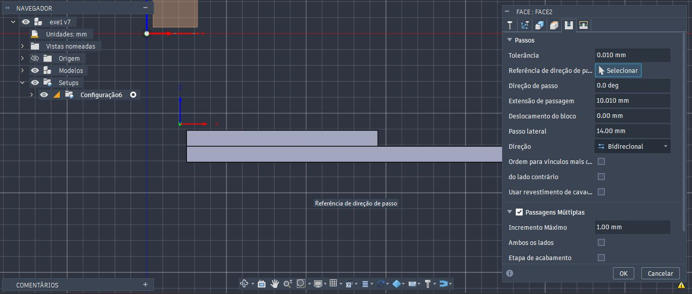

<i>Figura 12: Configuração de Passos</i>

Note que o caminho ficará visível por onde a ferramenta irá fazer o faceamento.

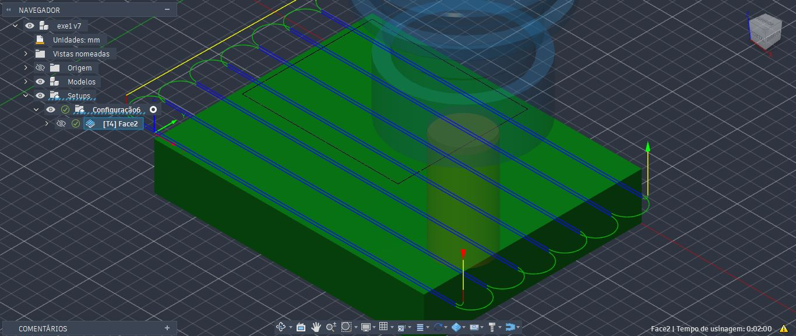

<i>Figura 13: Linhas do caminho por onde a ferramenta se guiará</i>

Ao executar a simulação, em Navegador => Setups => Configuração. Clique com o botão direito, e opte por Simular. Se tudo estiver correto, a ferramenta movimentará, e ao concluir a simulação, a área faceada mudará de cor.

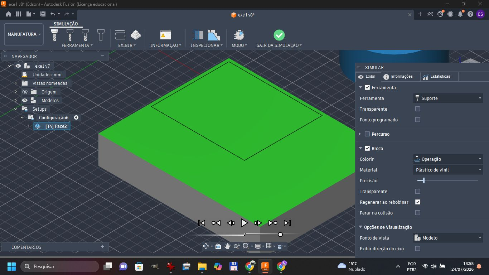

<i>Figura 14: Simulação para Faceamento</i>

<h3>Contorno 2D</h3>

O processo para remoção do contorno da peça tem passos parecidos com a que realizamos para o faceamento. Selecionamos uma ferramenta para remover os contornos, através da aba Fresagem => 2D => Contorno 2D. Escolhemos a seguir uma ferramenta, desta vez com um diâmetro menor, já que iremos apenas remover contornos.

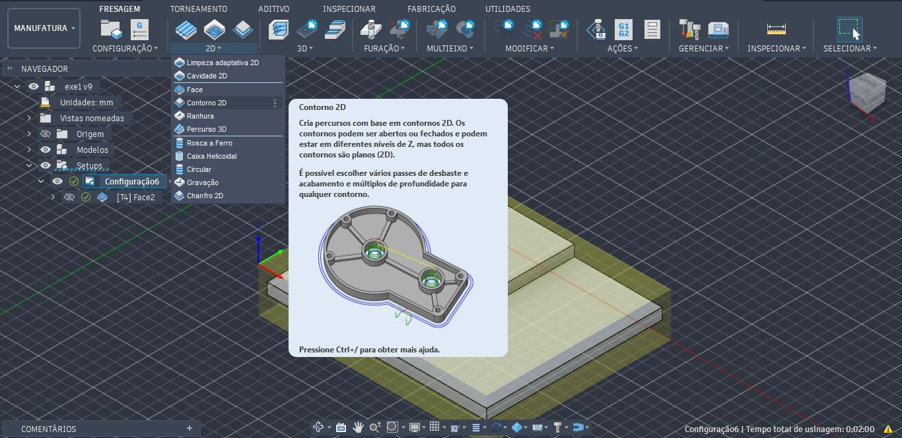
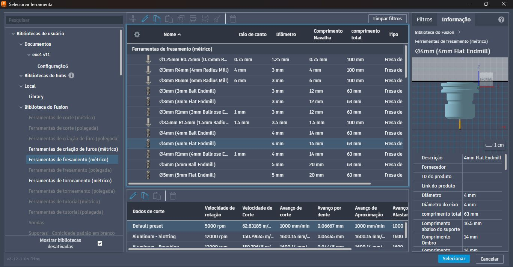

<i>Figura 15 e 16: Configuração para Contorno 2D, e escolha de Ferramenta.</i>

Na aba Geometria, em Seleção de contorno => Selecionar, devemos selecionar a borda inferior do plano. Note que uma seta vermelha aparecerá paralelo à aresta inferior. 

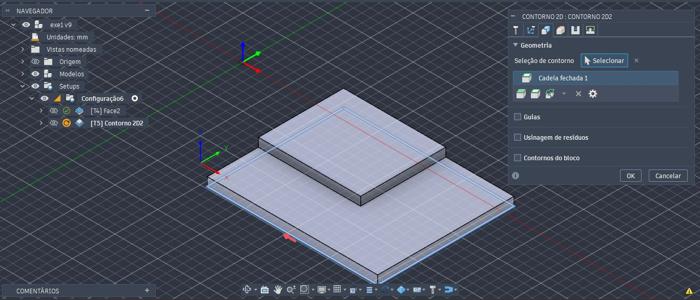

<i>Figura 18: Configuração em Geometria</i>

Na aba Planos de trabalho, as opções indicando "Topo do bloco" devem ser alteradas para "Topo do modelo", porque o faceamento foi executado, e a ferramenta partirá da posição onde está sinalizado na linha azul (Deslocamento superior).

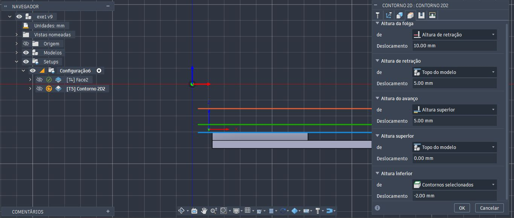

<i>Figura 19: Configuração em Planos de trabalho</i>

Na aba Passos, habilitamos a opção Passagens Múltiplas. O passo vertical máximo indicamos 4.0 mm, com 4 passos verticais, e 2.00 mm de passo vertical de acabamento.

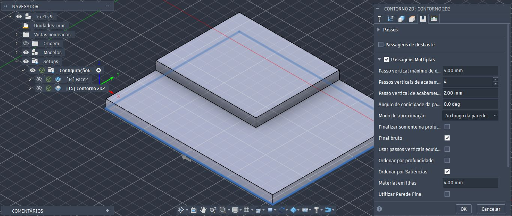

<i>Figura 20: Configuração em Passos</i>

Ao realizar a simulação, removemos o contorno externo.

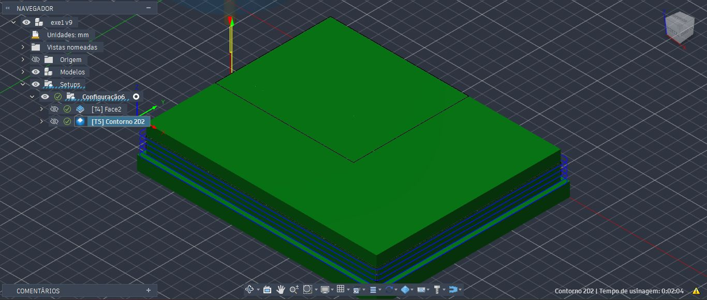
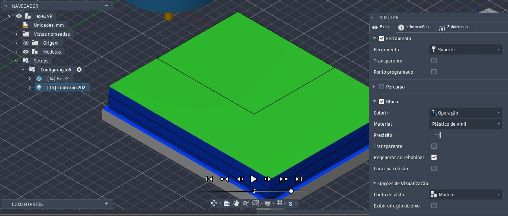

<i>Figura 21 e 22: Simulação para Contorno 2D</i>

<h3>Cavidade 2D</h3>

Para realizar o desbaste na cavidade da peça, selecionamos a aba Fresagem => 2D => Cavidade 2D. O processo de escolha da ferramenta é o mesmo, com a diferença da ferramenta Ø20mm (20mm Flat Endmill), já que temos uma área ainda extensa para o desbaste. 

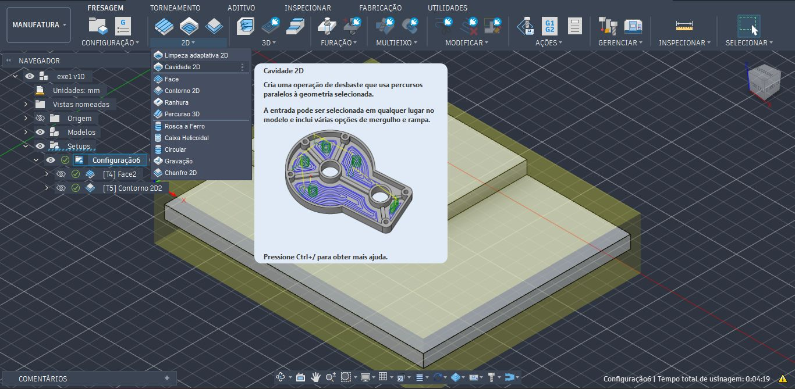

<i>Figura 23: Seleção para Cavidade 2D</i>

Na aba Geometria, faremos a seleção da face destacada em azul claro, através da opção Seleções de cavidade => Selecionar.

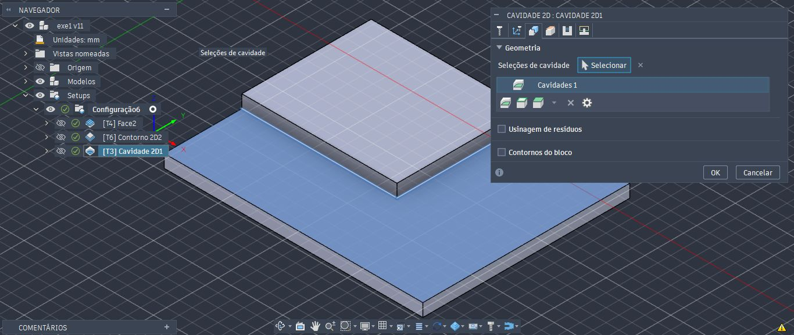

<i>Figura 24: Seleção para Geometria</i>

Na aba Planos de trabalho, as opções indicando "Topo do bloco" devem ser alteradas para "Topo do modelo", porque o faceamento foi executado, e a ferramenta partirá da posição onde está sinalizado na linha azul (Deslocamento superior).

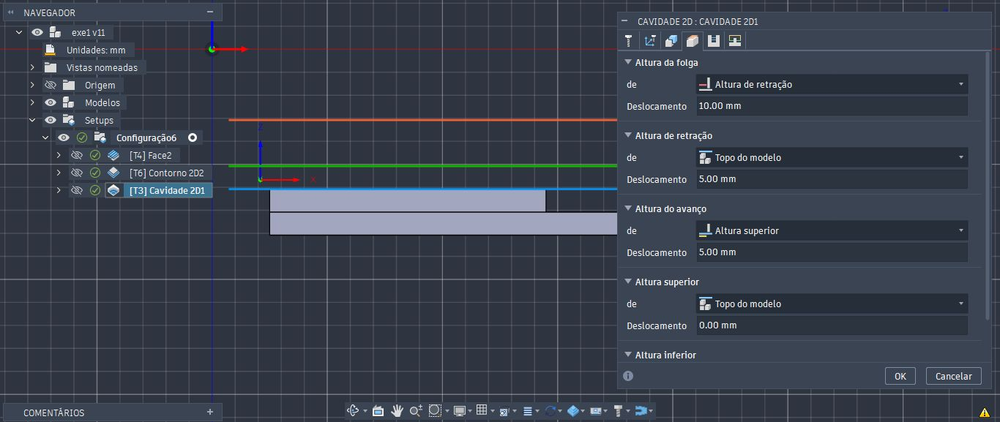

<i>Figura 25: Seleção para Planos de trabalho</i>

Na aba Passos, habilitaremos as opções Passagens múltiplas, e Bloco a ser deixado. Note que nesta última, será deixado 0.500 mm tanto para o material radial, como para o sobrematrial axial. Como aplicaremos uma ferramenta de maior diâmetro, deixaremos uma sobra para que uma nova etapa desbaste faça um acabamento no fundo, quanto nas laterais restantes.

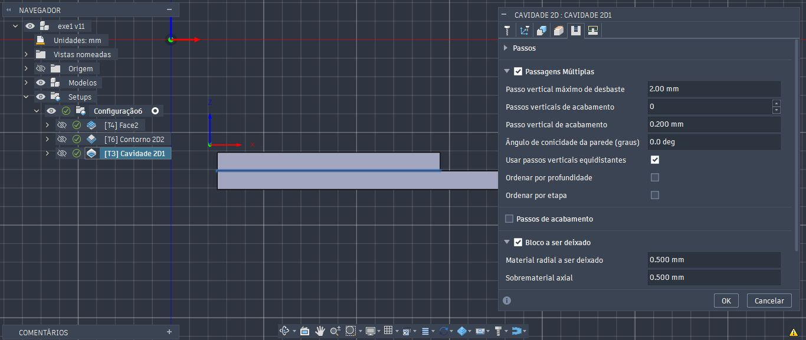

<i>Figura 26: Seleção para Passos</i>

Ao finalizar a simulação, é perceptível que restaram algumas áreas que ainda devam ser desbastadas.

<h3>Cavidade 2D (Parte 2)</h3>

Em vez de configurar novamente, basta duplicar clicando com o botão direito no processo anterior. 

A diferença está na ferramenta que iremos utilizar, com um diâmetro menor que o anterior.

Em passos, deixaremos todas as opções desabilitadas.

Ao finalizar a simulação, as áreas restantes serão tratadas, concluíndo o processo de fresagem da peça.

