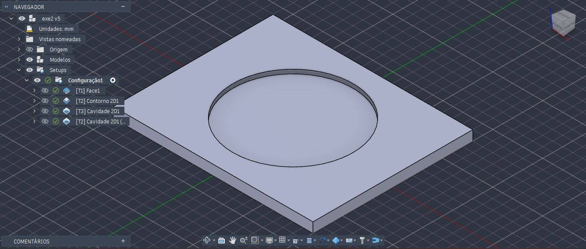
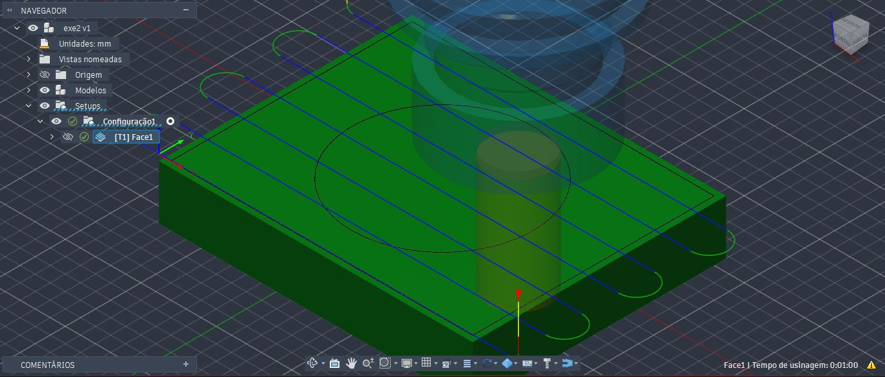
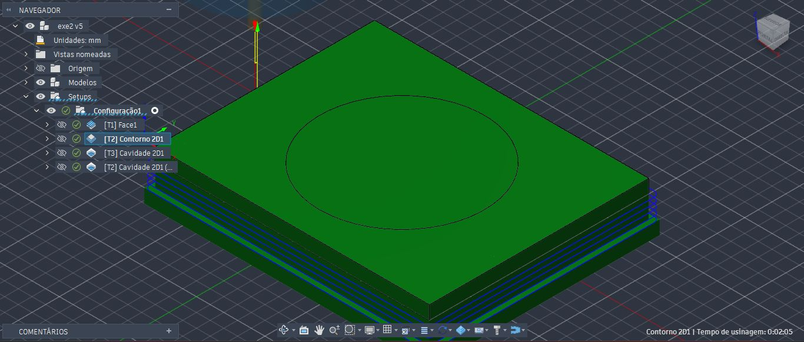
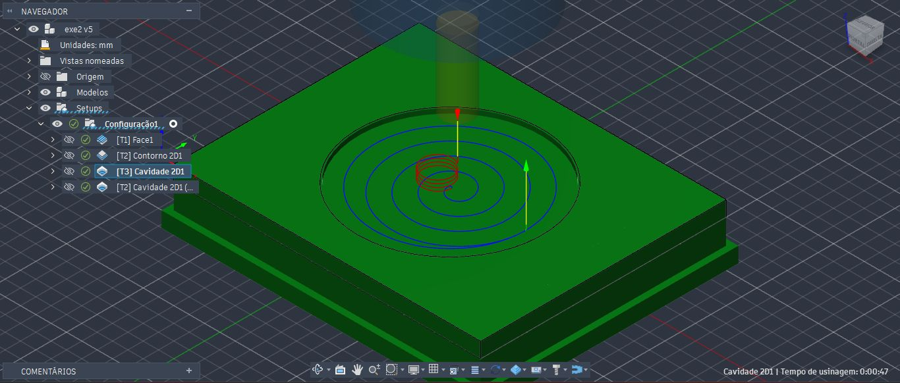
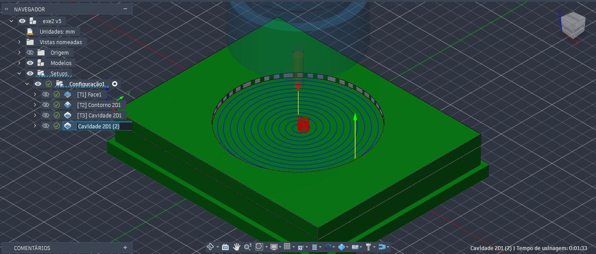
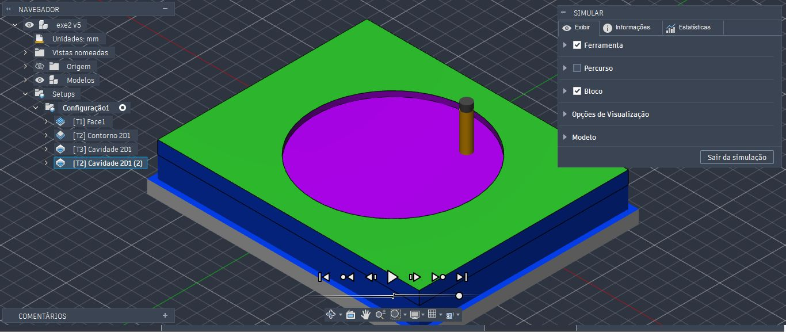

<h1>Simulação de Processo de Fresagem</h1>

<h3>Peça 3</h4>

O processo de fresagem para esta peça segue processos semelhantes aos exercícios de fresagem anterior. Desta vez, mostraremos apenas as etapas finais de cada etapa. 

Para esta peça, um passo importante para realizar o contorno na peça foi delimitar a profundidade desejada. Na aba Planos de trabalho, podemos definir a altura inferior de deslocamento, conforme o referencial escolhido. Como a peça possui 5mm de altura, aplicamos 8 mm abaixo da altura superior de deslocamento para dar uma sobra para a peça ser separada.

  
