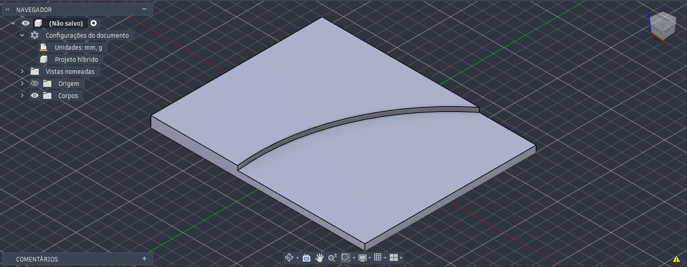
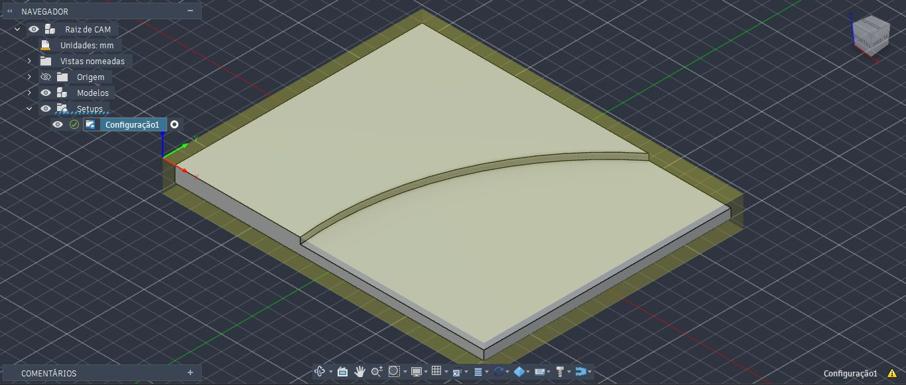
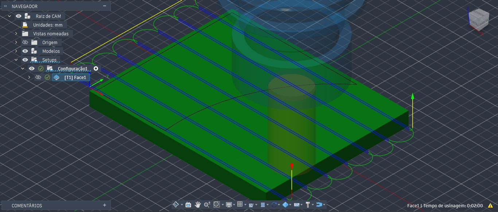
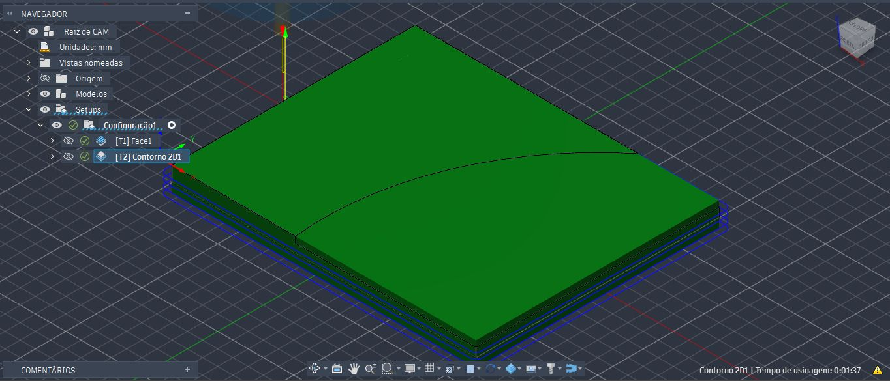
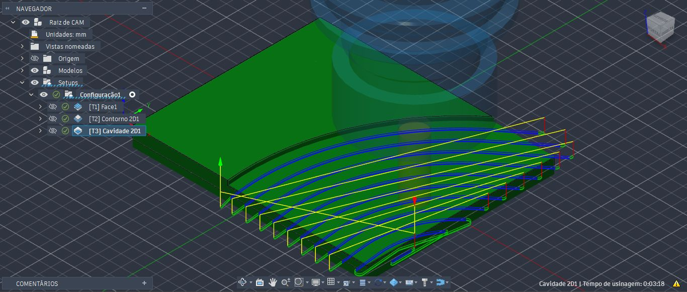
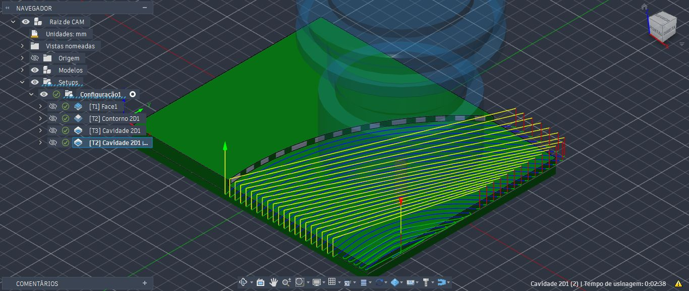
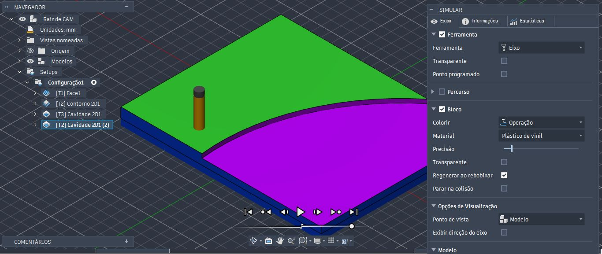

<h1>Simulação de Processo de Fresagem</h1>

<h3>Peça 4</h4>

O processo de fresagem para esta peça segue processos semelhantes aos exercícios de fresagem anterior. Desta vez, mostraremos apenas as etapas do processo. 

 
Figura 1: Peça 4

 
Figura 2: Configuração e bloco

 
Figura 3: Processo de faceamento

 
Figura 4: Processo de contorno 2D

 
Figura 5: Processo de cavidade 2D

 
Figura 6: Processo de cavidade 2D, acabamento

 
Figura 7: Simulação

  
