# Elementos de Fixação e Posicionamento
### Análise aplicada aos processos de Torneamento e Fresamento

## 1. Introdução

Elementos de fixação (*jigs & fixtures*) são dispositivos usados em processos de usinagem para posicionar e imobilizar a peça durante a fabricação, garantindo que ela permaneça na posição correta em relação à ferramenta de corte durante todo o processo. 

Os dispositivos de fixação devem cumprir duas funções essenciais:

* **Manter a peça firmemente posicionada** sob a ação das forças de usinagem e das forças dinâmicas geradas durante o processo, sem danificá-la;
* **Permitir o acesso da ferramenta** às superfícies que precisam ser usinadas, sem interferências mecânicas.

A escolha do dispositivo também envolve considerações práticas, como o custo do projeto do dispositivo e o tempo de carregamento e descarregamento da peça — fatores que impactam diretamente a produtividade da operação.

## 2. Fundamentos Teóricos do Posicionamento

Antes de detalhar os elementos específicos de torno e fresa, é necessário entender a base teórica comum a qualquer sistema de fixação: a regra dos seis pontos de apoio.

### 2.1 A Regra dos Seis Pontos

Qualquer corpo rígido no espaço possui seis graus de liberdade: três translações (ao longo dos eixos X, Y e Z) e três rotações (em torno desses mesmos eixos). Para imobilizar completamente uma peça, é necessário restringir todos esses seis graus de liberdade, o que é feito através de seis pontos de contato distribuídos estrategicamente:

* **3 pontos** de posicionamento, localizados em um plano (xy), restringem 2 rotações (eixo x e y) e 1 translação (eixo z);

* **2 pontos** de posicionamento, localizados em um plano perpendicular ao anterior, restringem 1 rotação (eixo z) e 1 translação (eixo x ou y);

* **1 ponto** de posicionamento, localizado em um terceiro plano perpendicular aos outros dois, restringe a última translação (a do outro eixo).

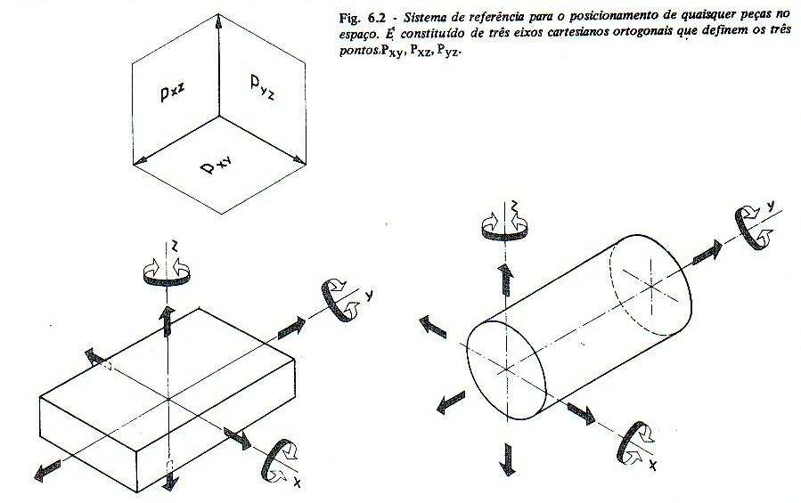
 
*Sistema de referência para o posicionamento de peças no espaço, com os três planos ortogonais Pxy, Pxz e Pyz.*

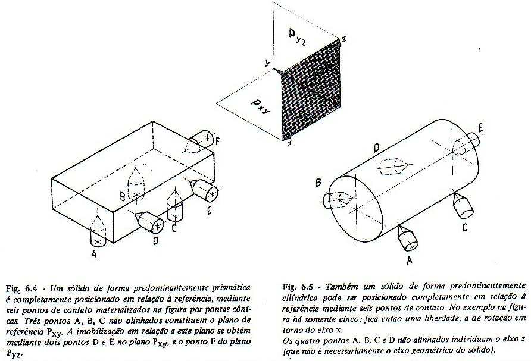
 
*Aplicação da regra dos 6 pontos em uma peça prismática (esquerda) e em uma peça cilíndrica (direita). No caso cilíndrico do exemplo, restam apenas 5 pontos de contato, deixando livre a rotação em torno do eixo x (naõ exatamente perpendicular ao eixo, e objetiva travar o deslizamento ao longo do eixo)— grau de liberdade que normalmente é o próprio movimento de corte do torno.*

### 2.2 Esquemas Práticos de Posicionamento

A tabela a seguir (presente no material de referência) resume como a disposição teórica dos pontos de contato se traduz em soluções construtivas práticas, dependendo do tipo de elemento geométrico que está sendo posicionado (plano, reta/orientação ou eixo):

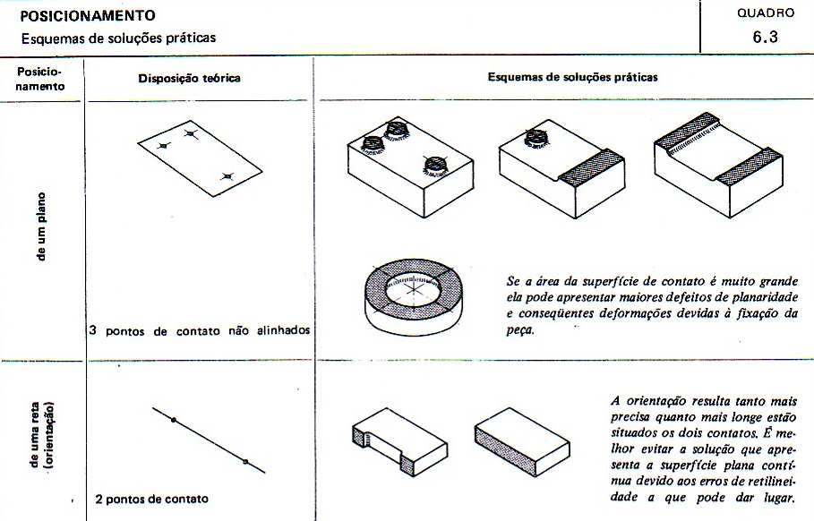
 
*Quadro 6.3 — esquemas de soluções práticas para posicionamento de um plano e de uma reta (orientação).*

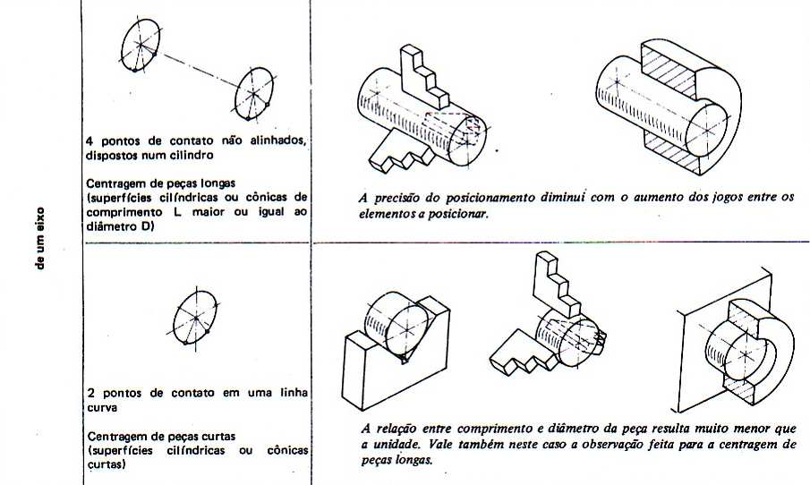
 
*Soluções práticas para posicionamento de um eixo, com distinção entre peças longas e peças curtas (relação comprimento/diâmetro).*

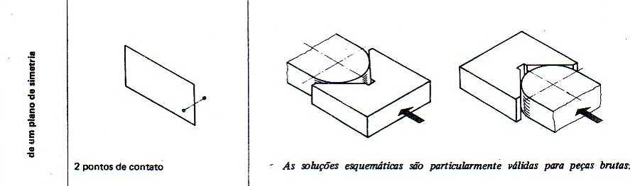
 
*Posicionamento a partir de um plano de simetria, útil quando a peça bruta não tem referência plana confiável.*

## 3. Elementos de Posicionamento (Localizadores)

Os localizadores são os componentes físicos que materializam os pontos de contato descritos na regra dos 6 pontos. Ou seja, eles eliminam os graus de liberdade, impedindo que a peça se desloque.

São, em geral, comuns tanto ao torno quanto à fresa, variando principalmente em formato conforme a geometria da peça (prismática ou cilíndrica).

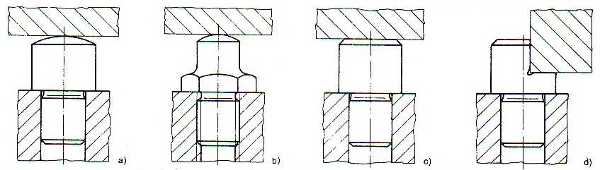
 
*Exemplos práticos de posicionamento de peças cilíndricas roscadas, mostrando diferentes formas de contato entre a peça e o dispositivo.*

### 3.1 Apoios Planos

Os apoios planos fixos são a solução mais simples para materializar pontos de contato em uma superfície plana (a do primeiro caso, de três pontos de contato em um plano xy). São frequentemente padronizados, com furos para fixação por parafusos, na base do dispositivo, garantindo que os apoios estejam fixos.

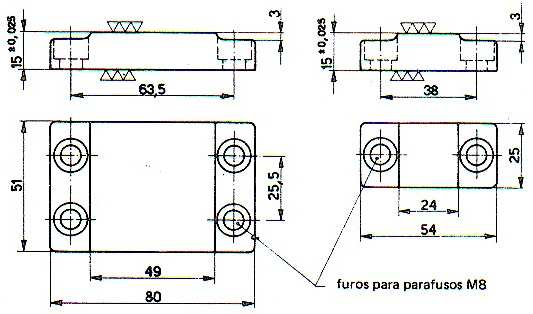
 
*Apoio plano fixo padronizado, com dimensões e furos para parafusos M8.*

Obs.: a peça será pressionada contra o apoio por meio de estribos/grampos, não por meios dos parafusos M8.

Vale a pena citar que haverá três grupos de localizadores (não necessariamente três peças físicas de apoio plano), somando 6 pontos de contato no total, para restringir os 6 graus de liberdade. Podemos ter até 6 pontos de apoio pequenos, separados, para cada ponto de contato.

### 3.2 Apoios de Dois Pontos

Utilizados principalmente para peças brutas ou de superfície irregular, onde um apoio contínuo geraria deformações por defeitos de planaridade. O apoio desdobrado autorregulável (Fig. 6.9) se adapta a pequenas variações da superfície bruta, enquanto o apoio fixo (Fig. 6.10) materializa dois pontos de contato através de dois planos pequenos alinhados.

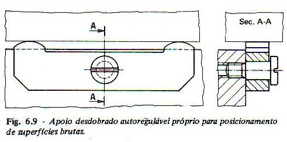
 
*Fig. 6.9 — Apoio desdobrado autorregulável, próprio para posicionamento de superfícies brutas.*

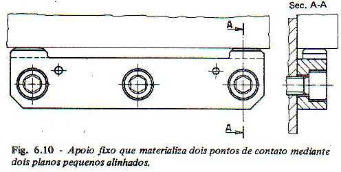
 
*Fig. 6.10 — Apoio fixo que materializa dois pontos de contato mediante dois planos pequenos alinhados.*

### 3.3 Prismas em V — o localizador central do torneamento

O prisma em V é um dos elementos mais importantes para o posicionamento de peças cilíndricas, sendo amplamente utilizado tanto na preparação de peças para torno quanto em dispositivos de fresa. Existem versões fixas, padronizadas por tabela (com abertura de 90°), e versões reguláveis, que permitem ajuste fino da posição.

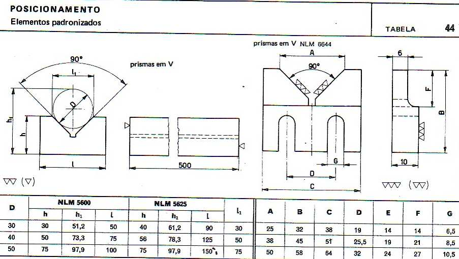
 
*Tabela de prismas em V padronizados (NLM 5600 / NLM 5625), com dimensões normalizadas conforme o diâmetro D da peça.*

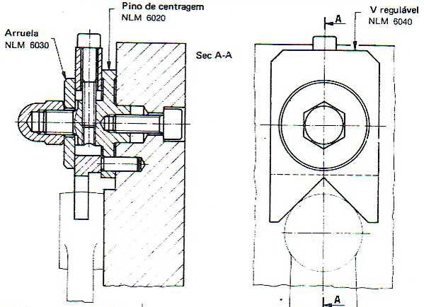
 
*Prisma regulável, com pino de centragem e V regulável — permite ajuste de posição não disponível nos prismas fixos.*

## 4. Elementos de Fixação (Grampos e Prensores)

Enquanto os localizadores posicionam a peça, os elementos de fixação (ou grampos) são responsáveis por exercer a força que mantém a peça imóvel contra os localizadores durante a usinagem, resistindo às forças de corte. O material de referência apresenta duas famílias principais: a fixação direta (parafusos e pinos) e o uso de estribos (grampos articulados).

### 4.1 Fixação Direta

A fixação direta ocorre por contato lateral direto entre o dispositivo e a peça, geralmente com auxílio de pinos de centragem que garantem o alinhamento correto antes do aperto.

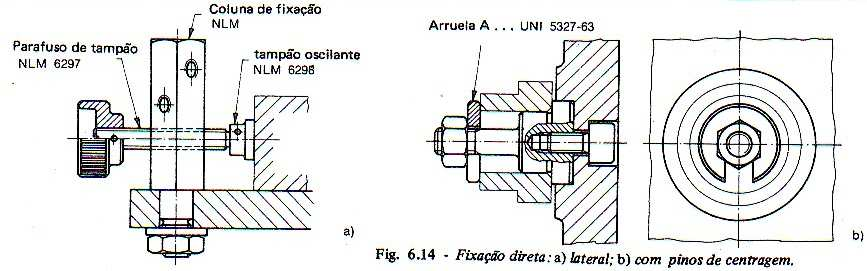
 
*Fig. 6.14 — Fixação direta: (a) lateral; (b) com pinos de centragem.*

### 4.2 Estribos (Grampos)

Os estribos são o elemento de fixação mais versátil e mais utilizado em dispositivos de fresa e furação. Funcionam com um parafuso central que, ao ser apertado, pressiona o estribo contra a peça, transmitindo a força de fixação. Existem variações padronizadas (estribos A, B e C) conforme a geometria de apoio necessária.

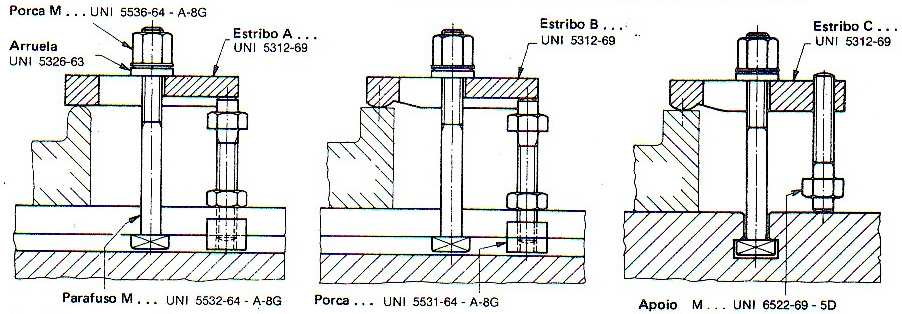
 
*Configurações padronizadas de estribos com parafuso, porca e apoio (normas UNI), usadas em fresamento e furação.*

Duas variações adicionais merecem destaque: o estribo com bloqueio a excêntrico, que permite fixação e liberação rápida sem necessidade de desenroscar totalmente o parafuso (útil em operações de troca frequente de peça); e o estribo em cotovelo (simples ou duplo), utilizado quando o ponto de fixação precisa alcançar uma região da peça em nível diferente do apoio.

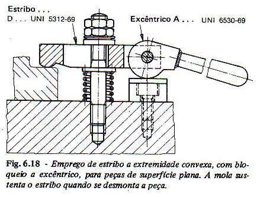
 
*Fig. 6.18 — Estribo de extremidade convexa com bloqueio a excêntrico. A mola sustenta o estribo quando a peça é desmontada, agilizando a troca.*

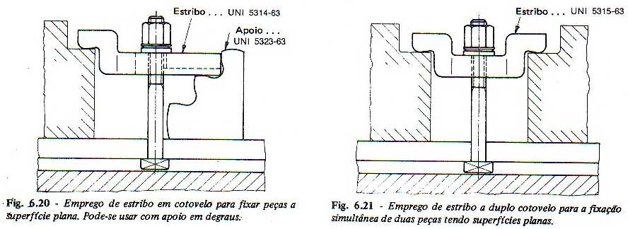
 
*Fig. 6.20 e 6.21 — Estribo em cotovelo (simples e duplo), usado para fixar peças com superfícies em níveis distintos.*

## 5. Elementos de Fixação Específicos para Torneamento

No torneamento, a peça gira presa ao eixo-árvore da máquina, enquanto a ferramenta permanece essencialmente estacionária (executando apenas avanços lineares). Por isso, o requisito central da fixação no torno é a **centragem precisa** da peça em torno do eixo de rotação — qualquer excentricidade gera vibração, erro de forma e desgaste prematuro da ferramenta. O material de referência apresenta três soluções clássicas:

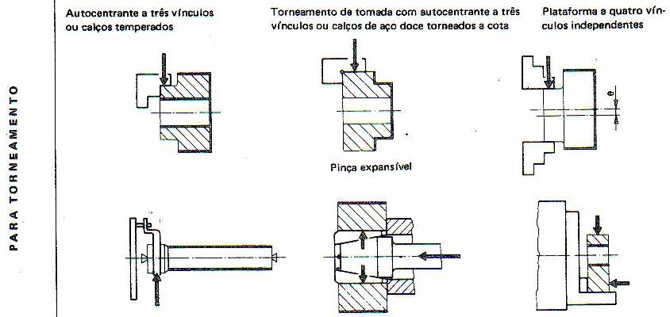
 
*Soluções de fixação para torneamento: autocentrante a três vínculos, pinça expansível e plataforma a quatro vínculos independentes.*

* **Autocentrante a três vínculos (placa de 3 castanhas):** as três castanhas se movem simultaneamente e de forma sincronizada em direção ao centro, centrando automaticamente peças cilíndricas ou hexagonais. É a solução mais comum e rápida para peças de revolução regulares. Pode usar calços temperados para aumentar a durabilidade em produção seriada.
* **Pinça expansível:** um mandril cônico se expande radialmente dentro de um furo da peça (ou externamente sobre um eixo), garantindo centragem de alta precisão. É especialmente indicada para operações de acabamento onde a concentricidade é crítica.
* **Plataforma a quatro vínculos independentes:** cada um dos quatro grampos pode ser ajustado individualmente, permitindo fixar peças de geometria assimétrica ou irregular que não poderiam ser centradas por um sistema autocentrante convencional.

Vale notar que, no torno, boa parte da restrição dos graus de liberdade da peça é obtida naturalmente pelo próprio princípio de fixação rotativo — diferente da fresa, onde os seis pontos da regra teórica precisam ser materializados de forma mais explícita por localizadores independentes.

## 6. Elementos de Fixação Específicos para Fresamento

No fresamento, a peça permanece fixa (presa à mesa da máquina) enquanto a ferramenta gira e se desloca, gerando forças de corte que mudam de direção ao longo da trajetória de usinagem. Isso exige uma fixação robusta e distribuída em múltiplos pontos, capaz de resistir a essas forças variáveis sem permitir deslocamento ou vibração da peça.

### 6.1 Fixação para Aplainamento e Fresamento

O material distingue a fixação de peças brutas (superfícies irregulares, ainda sem usinagem) da fixação de peças já trabalhadas (superfícies de referência já usinadas, permitindo maior precisão de apoio):

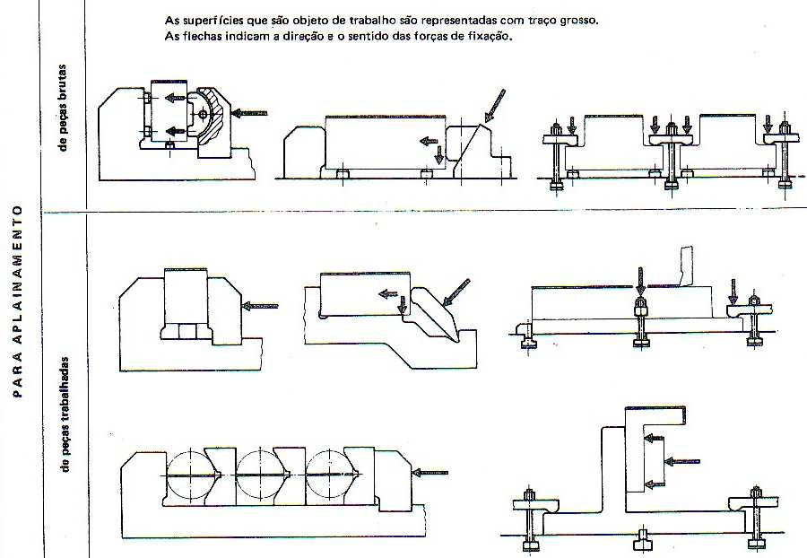
 
*Esquemas de fixação para aplainamento/fresamento: peças brutas (superior) e peças já trabalhadas (inferior). As setas indicam a direção e o sentido das forças de fixação; as superfícies em traço grosso são as que serão usinadas.*

Nota-se que, para peças brutas, os elementos de fixação costumam ter área de contato menor e ajustável (para compensar irregularidades de fundição ou forjamento), enquanto para peças trabalhadas os apoios podem ser mais rígidos e distribuídos, já que a superfície de referência é confiável.

### 6.2 Fixação para Furação

Embora a furação seja um processo à parte, ela compartilha a lógica de fixação da fresa (peça estacionária, ferramenta rotativa) e frequentemente utiliza os mesmos dispositivos (buchas de furação, instrumentos especiais para guiar a broca com precisão):

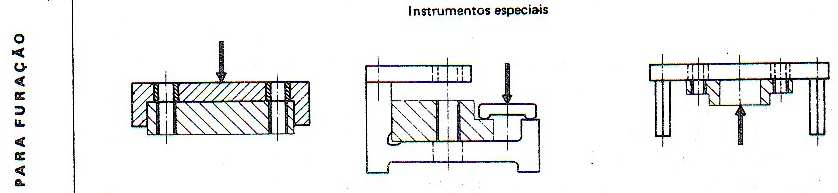
 
*Dispositivos de fixação e guia para operações de furação, incluindo buchas guia e instrumentos especiais.*

## 7. Quadro Comparativo: Torno × Fresa

A tabela a seguir sintetiza as principais diferenças entre os requisitos de fixação nos dois processos:

| Aspecto | Torneamento (Torno) | Fresamento (Fresa) |
|---|---|---|
| **Movimento relativo** | A peça gira; a ferramenta é estacionária (ou avança linearmente). | A peça é estacionária (presa à mesa); a ferramenta gira. |
| **Geometria típica da peça** | Predominantemente peças de revolução (cilíndricas, cônicas). | Peças prismáticas, planas ou de geometria irregular. |
| **Elemento de fixação típico** | Placa autocentrante a 3 castanhas, pinça expansível, plataforma a 4 vínculos independentes. | Morsa, estribos (grampos), prismas em V, apoios planos, placa magnética. |
| **Exigência principal** | Centragem precisa em torno do eixo de rotação — concentricidade é crítica. | Estabilidade contra forças de corte multidirecionais e vibração durante o avanço da fresa. |
| **Forças predominantes** | Força de corte tangencial, gerando torque em torno do eixo da peça. | Forças de corte variam de direção ao longo da trajetória da fresa, exigindo fixação mais rígida em múltiplos pontos. |
| **Base teórica (regra dos 6 pontos)** | Simplificada: a rotação da placa já restringe boa parte dos graus de liberdade em torno do eixo. | Aplicada de forma mais explícita: localizadores em 3-2-1 pontos (plano, reta, ponto) definem a peça no espaço. |

## 8. Planejamento do Dispositivo de Fixação

Independentemente do processo (torno ou fresa), o projeto de um dispositivo de fixação segue uma lógica de planejamento estruturado, baseada na análise das informações disponíveis: material da peça, geometria da matéria-prima bruta, operações requeridas e máquinas utilizadas.

O plano de fixação deve definir, no mínimo:

* A orientação da peça dentro do conjunto de fixação;
* A indicação da superfície à qual se aplicará cada elemento de fixação;
* O tipo de elemento do conjunto de fixação a ser utilizado (localizador, grampo ou suporte).

A partir dessas definições, gera-se o **leiaute de fixação**, que materializa fisicamente os conceitos, especificando: posição dos localizadores, posição dos grampos, posição dos suportes, e os respectivos tipos de cada um desses elementos.

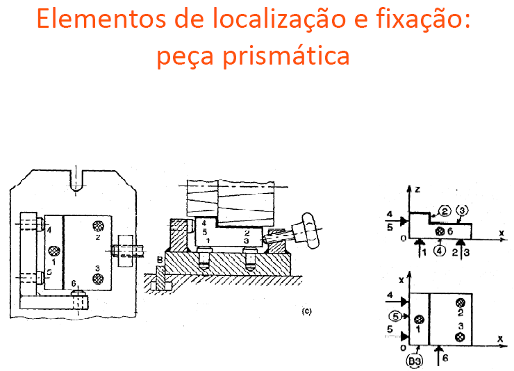
 
*Exemplo de aplicação prática da regra dos 6 pontos em uma peça prismática: os pontos 1, 2 e 3 definem o plano principal; 4 e 5 definem a orientação; e o ponto 6 restringe a última translação — com os respectivos elementos de fixação (grampos) posicionados de forma coerente com as forças de corte esperadas.*

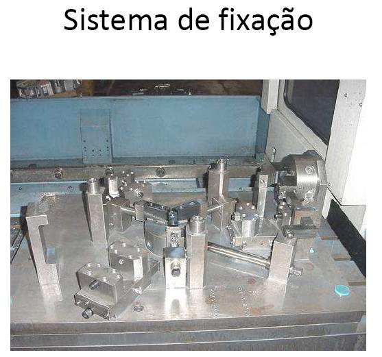
 
*Sistema de fixação real, montado sobre a mesa de uma máquina, combinando múltiplos localizadores e grampos.*

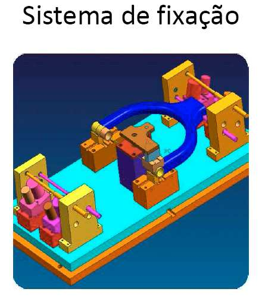
 
*Modelo CAD de um sistema de fixação, evidenciando a integração entre localizadores, grampos e a peça a ser usinada.*

## 9. Conclusão

Os elementos de posicionamento e fixação compartilham uma base teórica comum — a regra dos seis pontos — mas sua aplicação prática se diferencia significativamente entre torno e fresa, refletindo a natureza distinta de cada processo:

* **No torno,** a fixação gira em torno do problema de centragem, resolvido principalmente por dispositivos rotativos (placas autocentrantes, pinças, plataformas), já que o próprio movimento de rotação da peça simplifica parte da restrição dos graus de liberdade.
* **Na fresa,** a fixação precisa materializar de forma explícita e distribuída os seis pontos de apoio, com localizadores (apoios planos, prismas) e grampos (estribos) posicionados estrategicamente para resistir a forças de corte que mudam de direção ao longo do percurso da ferramenta.

Em ambos os casos, a escolha correta dos elementos de fixação impacta diretamente a precisão dimensional da peça usinada, a produtividade do processo (tempo de carga/descarga) e o custo do dispositivo — sendo, portanto, uma etapa de projeto tão relevante quanto a definição dos próprios parâmetros de corte.
