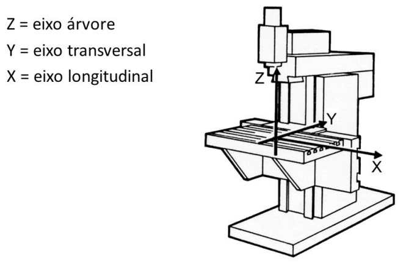
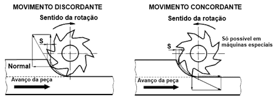
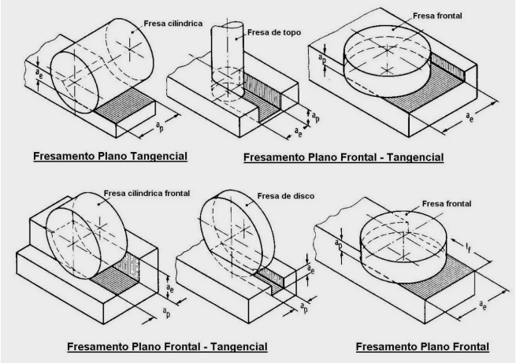
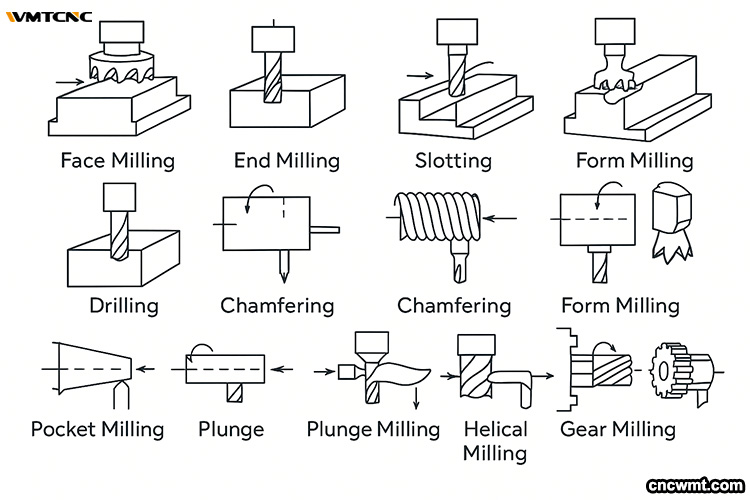
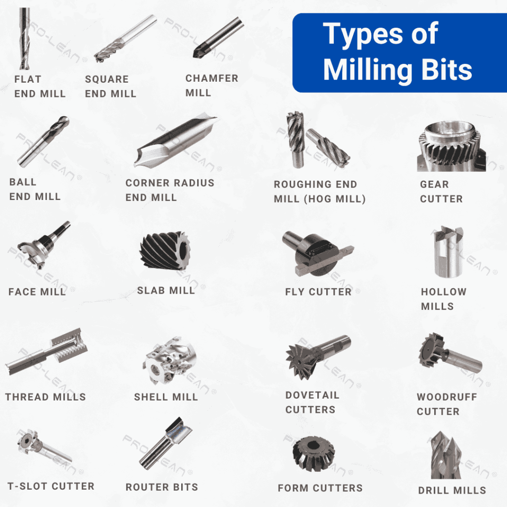
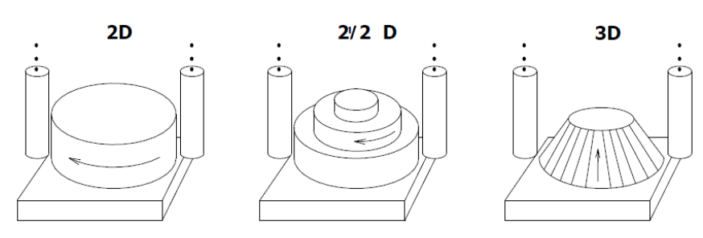

# Fresamento

É um processo de usinagem destinado à obtenção de superfícies planas, contornos, perfis e cavidades em peças de geometria **prismática**. Diferente do torneamento, onde a peça gira, no fresamento a ferramenta de corte é que possui o movimento de rotação.

### **1. Princípio Mecânico do Fresamento**
O processo baseia-se na remoção de material através de uma ferramenta rotativa multidentada chamada **fresa**.
*   **Dinâmica de Corte:** A fresa gira em alta velocidade enquanto a peça é fixada em uma mesa que se desloca (avanço) gradualmente em direção à ferramenta.
*   **Geração de Cavacos:** A remoção ocorre quando as arestas cortantes da fresa entram em contato com a peça, cortando ou raspando o material e gerando o cavaco.
*   **Versatilidade:** O método permite usinar uma grande variedade de materiais com alta eficiência de remoção.
*   **Habilidade exigida:** A operação requer conhecimento técnico para a seleção correta das ferramentas, dos parâmetros de corte e para garantir a segurança durante o processo.

### **2. A Máquina e seus Eixos (Fresadora CNC)**

Nas fresadoras e centros de usinagem, o sistema de coordenadas define a trajetória da ferramenta no espaço:
*   **Eixo Z:** Corresponde ao **eixo-árvore** (onde a ferramenta é fixada). Pode ser posicionado na vertical ou na horizontal.
*   **Eixo X:** Refere-se ao movimento **longitudinal** da mesa.
*   **Eixo Y:** Refere-se ao movimento **transversal** da mesa.

#### A convenção padrão
* Eixo X → movimento longitudinal (o de maior curso na mesa, geralmente da esquerda para a direita, olhando de frente para a máquina)
* Eixo Y → movimento transversal (perpendicular a X, geralmente de trás para frente/frente para trás)
* Eixo Z → movimento vertical, paralelo ao eixo-árvore (como já confirmamos)

#### Uma forma prática de fixar isso

Numa fresa vertical convencional, imagine-se de frente para a máquina, olhando para a mesa:

* Mover a mesa da esquerda para a direita = eixo X
* Mover a mesa para dentro/fora, na sua direção = eixo Y
* Subir/descer o cabeçote (ou a mesa, dependendo da máquina) = eixo Z

#### Conectando com os localizadores

| Eixo da máquina | Movimento | Grau de liberdade que os localizadores travam |
|---|---|---|
| Z | Vertical (avanço/recuo da ferramenta) | Translação em Z → travada pelos 3 pontos (plano XY) |
| X | Longitudinal | Translação em X → travada pelo 1 ponto final |
| Y | Transversal | Translação em Y → travada pelos 2 pontos |

### **3. Classificação quanto ao Sentido de Corte: Concordante e Discordante**
Antes de detalhar as operações, é fundamental entender como a fresa se relaciona com o sentido de avanço da peça — essa é a classificação mais importante do processo, com impacto direto em acabamento, vibração e vida útil da ferramenta.

https://blog.superbid.net/maquinas-fresadoras-aprenda-a-usinar-metais/

*   **Fresamento Discordante (convencional):** O sentido de rotação da fresa é **contrário** ao sentido de avanço da peça. O cavaco começa fino e termina espesso — a ferramenta "raspa" a peça antes de efetivamente cortar, gerando mais atrito e calor no início do contato. É mais indicado para peças brutas ou com casca de fundição/laminação, pois a fresa "entra por baixo" da superfície irregular, sem impactar diretamente contra ela.
*   **Fresamento Concordante:** O sentido de rotação da fresa é **igual** ao sentido de avanço da peça. O cavaco começa espesso e termina fino, reduzindo o atrito no início do corte e gerando melhor acabamento superficial. Exige, porém, uma máquina rígida e sem folgas no fuso da mesa — caso contrário, a força de corte pode "puxar" a peça e a ferramenta, causando vibração ou quebra de dentes.

| Aspecto | Discordante | Concordante |
|---|---|---|
| Espessura do cavaco | Cresce (fino → espesso) | Decresce (espesso → fino) |
| Desgaste da ferramenta | Maior (atrito inicial) | Menor |
| Acabamento superficial | Inferior | Superior |
| Exigência da máquina | Menor (tolera folgas) | Maior (requer rigidez, sem folga no fuso) |
| Indicação típica | Peças brutas, cascas duras | Peças pré-usinadas, acabamento fino |

### **4. Classificação quanto à Orientação: Tangencial e Frontal**
Complementando a classificação anterior, o fresamento também se divide conforme a posição do eixo da fresa em relação à superfície gerada. Essa classificação se desdobra em três variantes, cada uma associada a tipos específicos de ferramenta:

| Variante | Como a fresa corta | Ferramentas típicas |
|---|---|---|
| **Fresamento Plano Tangencial** | O eixo da fresa é **paralelo** à superfície; o corte ocorre só pela periferia da ferramenta | Fresa cilíndrica |
| **Fresamento Plano Frontal-Tangencial** | Corte combinado — parte pela periferia (lateral), parte pela face (topo) | Fresa de topo, fresa cilíndrica frontal, fresa de disco |
| **Fresamento Plano Frontal** | O eixo da fresa é **perpendicular** à superfície; o corte ocorre principalmente pela face frontal | Fresa frontal (cabeçote fresador) |

Em qualquer uma dessas variantes, dois parâmetros geométricos definem a passada de corte (retomados na Seção 8 — Parâmetros de Corte):
*   **a_p (profundidade de corte axial):** o quanto a fresa penetra ao longo do seu próprio eixo;
*   **a_e (penetração de trabalho radial):** o quanto a fresa avança lateralmente sobre a peça.

O fresamento tangencial puro é o princípio por trás de rasgos e canais; o frontal puro é o princípio do faceamento; e o frontal-tangencial é o mais versátil, presente na maioria das fresas de topo usadas no dia a dia.

### **5. Tipos de Fresadoras**
A escolha da máquina influencia diretamente a rigidez do processo e o tipo de operação viável:

*   **Fresadora Horizontal:** O eixo-árvore é paralelo à mesa. Tradicionalmente usada para fresamento tangencial, rasgos e canais, com boa rigidez para desbaste pesado.
*   **Fresadora Vertical:** O eixo-árvore é perpendicular à mesa. É a configuração mais comum atualmente, adequada para faceamento, cavidades e contornos.
*   **Fresadora Universal:** Permite girar o cabeçote, combinando as capacidades horizontal e vertical na mesma máquina.
*   **Centro de Usinagem CNC:** Fresadora com controle numérico computadorizado, geralmente com troca automática de ferramentas (ATC) e capacidade de operar em 3, 4 ou 5 eixos simultâneos, permitindo usinagem 3D complexa sem reposicionamento manual da peça.

### **6. Principais Operações de Usinagem**
O processo é dividido em operações específicas conforme o formato desejado:

*   **Rasgo ou Canal:** Cria uma abertura em linha reta na superfície da peça, feita com fresa de corte reto. Usado, por exemplo, para rasgos de chaveta.
*   **Faceamento:** Remove material da face da peça para produzir uma superfície plana, perpendicular ao eixo da fresa — normalmente para nivelar a peça ou preparar uma referência para operações seguintes. Utiliza-se um **cabeçote fresador**.
*   **Ranhura:** Cria uma cavidade em uma superfície plana ou curva da peça, geralmente com uma **fresa de topo** — diferente do rasgo, a ranhura não necessariamente atravessa a peça em linha reta de ponta a ponta.
*   **Fresamento de Topo:** Remove material da superfície para criar um perfil ou uma cavidade, utilizando uma **fresa de topo**.
*   **Faceamento de Cantos a 90°:** Remove material dos cantos da peça para produzir uma superfície plana e perpendicular, com uma fresa de faceamento de cantos de 90°.
*   **Faceamento de Canto:** Remove material dos cantos para produzir uma superfície plana, com uma fresa de faceamento de canto — usada para remover rebarbas ou criar uma face plana pontual (diferente do faceamento de cantos a 90°, que gera uma referência angular específica).
*   **Arredondamento de Canto:** Remove material dos cantos para produzir um raio (suavizar cantos vivos), com uma fresa de topo.
*   **Faceamento Geral:** Remove material de uma superfície plana inteira para nivelá-la, com um cabeçote de faceamento — normalmente a primeira operação, preparando a peça bruta para as demais.
*   **Usinagem 3D:** Estratégias complexas de remoção de volume para criar formas tridimensionais, como moldes e cavidades esculpidas.

### **7. Tipos de Fresas (Ferramentas)**
Cada geometria de fresa é projetada para um propósito específico:

*   **Fresa Cilíndrica:** Corta apenas pela periferia, usada no fresamento plano tangencial puro (rasgos e canais longos).
*   **Fresa de Topo (end mill):** Corta pela periferia e pela ponta; a mais versátil, usada em cavidades, contornos e rasgos.
*   **Fresa Cilíndrica Frontal:** Combina corte periférico e frontal, usada em operações de fresamento plano frontal-tangencial.
*   **Fresa de Disco (fresa de fenda):** Corta principalmente pela periferia, ideal para rasgos estreitos e profundos ou seccionamento.
*   **Fresa Frontal:** Corte concentrado na face, usada no fresamento plano frontal — é a base do cabeçote fresador.
*   **Fresa Angular:** Possui arestas de corte inclinadas, usada para chanfros e rasgos em ângulo (como guias em cauda de andorinha).
*   **Fresa de Perfil (módulo):** Possui geometria específica para gerar um perfil determinado em uma única passada, como dentes de engrenagem.
*   **Fresa de Rosqueamento (thread mill):** Gera roscas internas ou externas por interpolação helicoidal, alternativa ao macho de roscar tradicional.
*   **Cabeçote Fresador (fresa de facear):** Grande diâmetro, múltiplos insertos intercambiáveis, usado especificamente para faceamento de grandes áreas com alta produtividade.

### **8. Parâmetros de Corte**
A produtividade e a qualidade do fresamento dependem do ajuste correto de três parâmetros principais:

*   **Velocidade de Corte (Vc):** Velocidade tangencial na periferia da fresa, geralmente em m/min. Depende do material da peça e da ferramenta (definindo a rotação da árvore, em rpm).
*   **Avanço por Dente (fz):** Espessura de material removida por cada dente da fresa a cada volta, geralmente em mm/dente. Combinado ao número de dentes e à rotação, define o avanço da mesa (mm/min).
*   **Profundidade de Corte (a_p) e Penetração de Trabalho (a_e):** a_p é a profundidade axial (o quanto a fresa penetra ao longo do seu eixo); a_e é a penetração radial (o quanto a fresa avança lateralmente na peça). Juntos, determinam o volume de material removido por passada — e são os mesmos parâmetros que diferenciam visualmente as variantes tangencial, frontal-tangencial e frontal da Seção 4.

O equilíbrio entre esses parâmetros define se a operação está otimizada para desbaste (alta remoção, tolerâncias abertas) ou para acabamento (baixa remoção, alta precisão) — reforçando a lógica de etapas já mencionada na seção de qualidade.

### **9. Classificação de Objetos Usinados: 2D, 2½D e 3D**
Além de classificar o processo em si, é comum classificar a **complexidade geométrica do objeto** a ser usinado, o que orienta a estratégia de programação CNC:

*   **2D:** A remoção de material ocorre em um único nível de profundidade, com a ferramenta se deslocando apenas no plano XY (contornos simples, sem variação de altura na trajetória).
*   **2½D (dois e meio D):** A peça possui múltiplos níveis distintos de profundidade (patamares), mas cada nível individual ainda é usinado em um plano constante — a ferramenta muda de altura (Z) entre um patamar e outro, mas não varia Z continuamente dentro da mesma trajetória de corte.
*   **3D:** A ferramenta varia continuamente sua posição em Z **durante** o próprio percurso de corte, permitindo gerar superfícies esculpidas, moldes e contornos complexos — típico de cavidades de moldes de injeção e superfícies orgânicas.

A escolha da estratégia de remoção (o caminho que a ferramenta percorre para "esvaziar" um volume) também varia com essa classificação — volumes simples podem ser removidos com trajetórias em espiral ou paralelas, enquanto volumes 3D exigem estratégias de acompanhamento de superfície mais sofisticadas.

### **10. Seleção do Processo de Usinagem conforme a Geometria da Peça**
A escolha de qual processo de usinagem utilizar não é feita isoladamente — ela depende da **capacidade do processo** de gerar a forma exigida, com a exatidão e o acabamento superficial necessários. Antes de detalhar parâmetros, a primeira decisão é identificar o grupo de processos compatível com a forma geral da peça:

| Peças Axissimétricas | Peças Prismáticas | *Features* Adicionais (em qualquer grupo) |
|---|---|---|
| Torneamento | **Fresamento** | Furação |
| Retificação | Retificação | Alargamento |
| Brunimento | Brunimento | Mandrilamento |
| Polimento | Polimento | Fresamento |
| Lapidação | Lapidação | Retificação, Roscamento |

O fresamento aparece tanto como processo principal (para peças prismáticas) quanto como *feature* adicional (por exemplo, para abrir um rasgo ou uma cavidade local em uma peça que, no geral, foi produzida por outro processo, como uma peça torneada que também precisa de um rasgo de chaveta).

### **11. Programação e Estratégias (CNC)**
Na usinagem por fresamento controlada por computador, seguem-se códigos padronizados para guiar o **caminho de corte**:
*   **Compensação de Diâmetro (G41/G42):** Essencial para que o CNC calcule o deslocamento necessário da ferramenta em relação ao contorno da peça, considerando o raio da fresa.
*   **Interpolações:** O comando **G01** realiza cortes em linha reta, enquanto **G02 (horário)** e **G03 (anti-horário)** realizam arcos e perfis circulares.
*   **Ciclos Fixos:** Utilizados para automatizar tarefas repetitivas como a furação (G81-G89) frontal ou lateral.
*   **Fresamento de Roscas e Interpolação Helicoidal:** Combina os movimentos G02/G03 (arco) com um deslocamento simultâneo no eixo Z, fazendo a fresa de rosqueamento percorrer uma trajetória helicoidal. Permite gerar roscas internas ou externas com uma única ferramenta, substituindo o macho de roscar convencional e reduzindo o risco de quebra da ferramenta em furos cegos.

### **12. Qualidade e Acabamento (Rugosidade)**
A rugosidade (erros microgeométricos) no fresamento é influenciada pelas marcas deixadas pelos dentes da fresa durante o avanço.
*   **Simbologia:** No desenho técnico, a indicação de fresamento é feita sobre o símbolo básico de rugosidade ($\sqrt{ }$) com a inscrição "**fresado**".
*   **Planejamento:** Para atingir acabamentos finos (Ra até 1,6 µm), o planejamento deve prever ao menos três etapas: **desbaste**, **semi-acabamento** e **acabamento**.
*   **Influência do sentido de corte:** Como visto na Seção 3, o fresamento concordante tende a gerar melhor acabamento que o discordante, sendo preferido nas etapas finais quando a máquina permite.

A precisão do fresamento depende criticamente do **posicionamento e fixação da peça** na mesa (usando morsas ou grampos), garantindo que ela suporte as forças dinâmicas da usinagem sem vibrações excessivas.