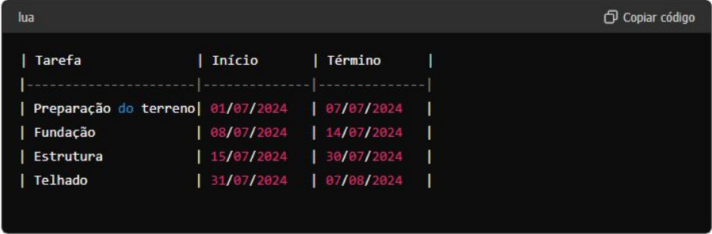
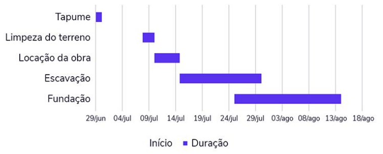
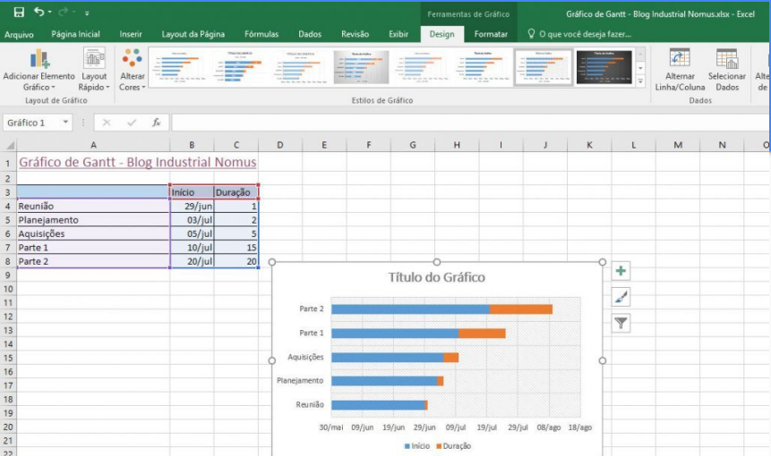
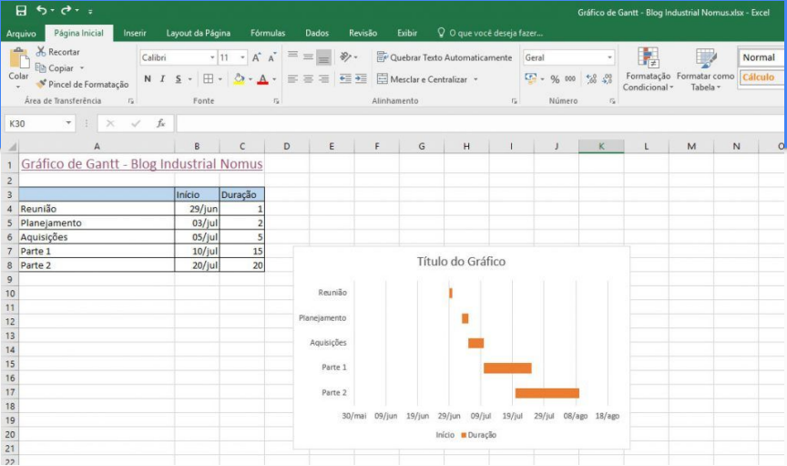
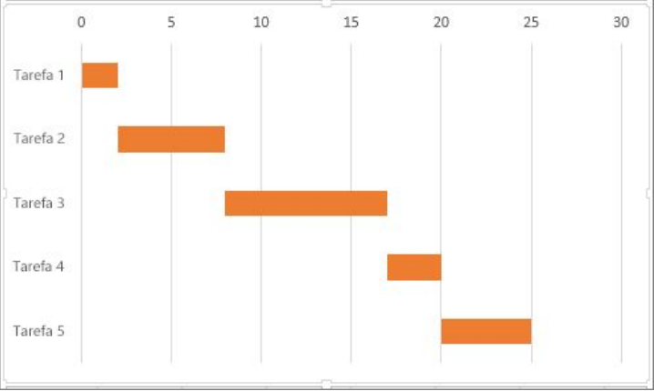

# Gráfico de Gantt

O Gráfico de Gantt é uma ferramenta poderosa e intuitiva que facilita o planejamento, a coordenação e o acompanhamento de tarefas em projetos de qualquer tamanho, garantindo que todos os envolvidos tenham uma compreensão clara do cronograma do projeto.

Nestes exemplos, cada tarefa é representada por uma barra horizontal que mostra seu início e término ao longo de uma linha do tempo.

