# PERT/CPM — Planejamento e Controle de Projetos

## Sumário
- [1. Introdução](#1-introdução)
- [2. Histórico](#2-histórico)
- [3. PERT vs. CPM](#3-pert-vs-cpm)
- [4. Representação da rede](#4-representação-da-rede)
- [5. Eventos e atividades](#5-eventos-e-atividades)
- [6. Tipos de atividades](#6-tipos-de-atividades)
- [7. Tipos de dependência](#7-tipos-de-dependência)
- [8. Princípios básicos para construção de redes](#8-princípios-básicos-para-construção-de-redes)
- [9. Datas cedo e tarde](#9-datas-cedo-e-tarde)
- [10. Folgas](#10-folgas)
- [11. Caminho crítico](#11-caminho-crítico)
- [12. Fases de execução (planejamento, programação, controle)](#12-fases-de-execução-planejamento-programação-controle)
- [13. Softwares que usam PERT/CPM](#13-softwares-que-usam-pertcpm)
- [14. Bibliografia](#14-bibliografia)


## 1. Introdução

PERT (*Program Evaluation and Review Technique*) e CPM (*Critical Path Method*) são metodologias de **gerenciamento de projetos**, usadas no planejamento, programação e controle, desde a definição das atividades até o acompanhamento da execução.

A apresentação do projeto em forma de **rede** permite identificar interdependências e a sequência lógica das atividades. Atrasos em atividades da rede repercutem diretamente no prazo final do projeto.

Antes das redes PERT/CPM, o planejamento era feito majoritariamente com o **gráfico de Gantt**, que representa tarefas como barras horizontais ao longo de uma linha do tempo (início/término), mas não evidencia bem as interdependências entre atividades.


## 2. Histórico

- **~1900** — primeiras técnicas de organização do trabalho (especialização de atividades de Taylor; gráfico de Gantt).
- **2ª Guerra Mundial** — grande desenvolvimento de técnicas matemáticas para tomada de decisão; após a guerra, esses especialistas migram para empresas privadas.

### PERT
- **Ano:** 1957
- **Desenvolvido por:** US Navy, em colaboração com a consultoria Booz Allen Hamilton
- **Motivação:** gerenciar o desenvolvimento do míssil balístico Polaris — projeto complexo e com muitas incertezas

### CPM
- **Ano:** final dos anos 1950 (1957–1959)
- **Desenvolvido por:** DuPont Corporation, em colaboração com a Remington Rand Corporation
- **Motivação:** otimizar o gerenciamento de projetos de manutenção de plantas químicas da DuPont, frequentes e complexos


## 3. PERT vs. CPM

| | **PERT** | **CPM** |
|---|---|---|
| Foco | Tempo | Tempo e custo |
| Natureza | Probabilística (incerteza na duração) | Determinística (durações conhecidas) |
| Estimativas | 3 tempos por atividade (otimista, mais provável, pessimista) | Tempo único por atividade |
| Aplicação típica | P&D, projetos inéditos, alta incerteza | Construção civil, manutenção industrial, atividades repetitivas |

**Tempo esperado (PERT):**

```math
TE = \frac{O + 4M + P}{6}
```

onde:
- **O** = tempo otimista (mínimo necessário)
- **M** = tempo mais provável
- **P** = tempo pessimista (máximo, em condições desfavoráveis)

Na prática, PERT e CPM costumam ser combinados — a maioria dos softwares de gestão de projetos integra os dois conceitos (rede + caminho crítico + estimativa probabilística quando aplicável).


## 4. Representação da rede

#### Caminho (rede)

A apresentação em forma de rede, permite identificar interdependências e a seqüência lógica das atividades. Atividades realizadas, em caso de atraso, repercutem diretamente no prazo final do projeto.

#### Representação

Existem dois métodos clássicos de representação gráfica:

### Método americano (atividade na seta)
- Os **eventos** (nós) são representados por círculos.
- A **atividade** é representada pela seta que liga dois eventos, com identificação e duração escritas sobre/sob a seta.

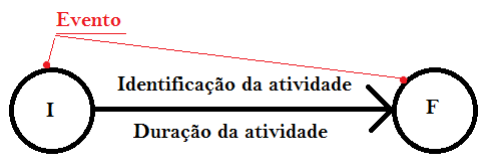<br>

### Método francês (atividade no nó)
- A **atividade** é representada por um retângulo (nó).
- As setas indicam apenas a sequência/dependência entre atividades.

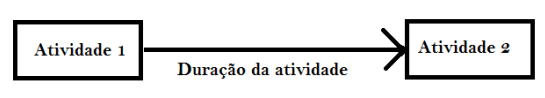<br>


### Exemplo comparativo
Atividades A, B, C precedem D, E, F (sem precedência entre A, B, C):

| Atividade | Duração |
|---|---|
| A | 2 |
| B | 3 |
| C | 4 |
| D | 5 |
| E | 6 |
| F | 7 |

- **Método americano:** três caminhos paralelos saindo do evento inicial (1) e convergindo no evento final (5), passando pelos eventos intermediários 2, 3, 4.

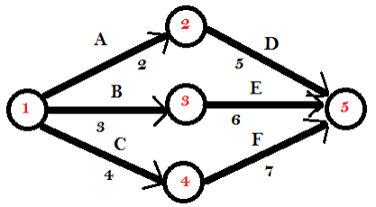<br>

- **Método francês:** três ramos paralelos entre os nós "Início" e "Fim", cada um com uma atividade precedente e uma sucessora (A→D, B→E, C→F).

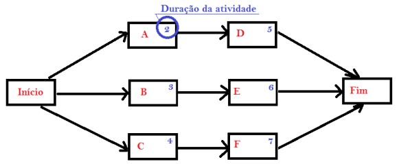<br>


## 5. Eventos e atividades

- **Evento:** marca o início ou o fim de uma atividade. Não consome tempo nem recursos.
- **Atividade:** delimitada por dois eventos. Consome tempo e/ou recursos financeiros.
- Uma atividade só pode começar quando o evento inicial for atingido, ou seja, quando **todas** as atividades que chegam a esse evento estiverem concluídas.
- Entre dois eventos sucessivos existe **somente uma** atividade.
- Não existem atividades em sentido retrógrado — a rede flui sempre para o futuro (sem *loops*).
- Tudo que consome tempo e pode ser previsto é uma atividade (ex.: cura do concreto, prazo de entrega de material, disponibilidade de equipamento).


## 6. Tipos de atividades

### 6.1 Atividade fantasma (fictícia)
Criada quando existem atividades paralelas entre os mesmos dois eventos, o que geraria ambiguidade na identificação (ex.: duas atividades "2-3"). Resolve-se inserindo um evento e uma atividade fictícios, representados por uma **seta tracejada**, que não consome tempo nem recursos.
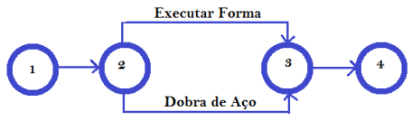<br>
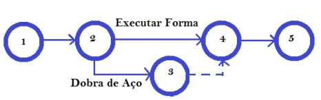<br>

### 6.2 Atividade dependente
Depende do cumprimento integral de outras atividades. Qualquer atividade que parte de um nó depende de todas as atividades que chegam a esse nó.
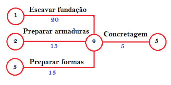<br>

### 6.3 Atividade independente
Quando uma atividade depende apenas de parte das atividades que convergem para um nó, é necessário usar uma atividade fantasma para representar corretamente a dependência parcial (evitando impor uma dependência que não existe).
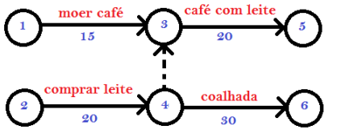<br>


### 6.4 Atividade condicionante
Impõe uma restrição ou uma data para a realização de outra atividade. Como não consomem tempo nem recursos, **atividades condicionantes são sempre atividades fantasmas**.

Exemplo:

Planejamento da concretagem de um bloco de fundação de um equipamento mecânico.
* Escavação fundação;
* Fôrmas;
* Armação;
* Ausência de Chuvas;
* Concretagem;
* Chegada do Equipamento na obra.

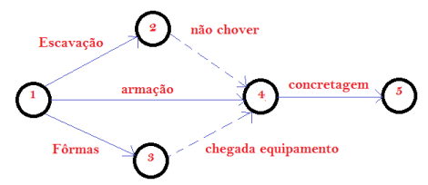<br>

A atividade “3-4” poderia ser uma restrição de data, exemplo: “Não iniciar antes de 30/10/2009”.

## 7. Tipos de dependência

- **Mandatória:** inerente à natureza física do trabalho.
- **Discricionária:** baseada no julgamento de quem planeja, ou em boas práticas/metodologias da área (ex.: inspecionar ferramentas antes de usar).
- **Externa:** relaciona atividades do projeto com atividades externas a ele (ex.: testes de integração dependendo da disponibilidade de um ambiente de outro projeto). Costuma se basear em dados históricos de projetos semelhantes.

> **Atenção a um erro comum de representação:** se A e B podem ocorrer em paralelo, C depende de A e B, e D depende só de B — **não** se deve fazer A e B convergirem no mesmo nó do qual saem C e D, pois isso impõe implicitamente que D também dependa de A. A representação correta usa uma atividade fantasma para isolar a dependência de D em relação apenas a B.
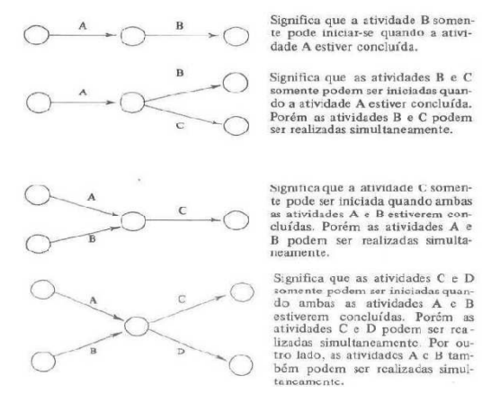<br>
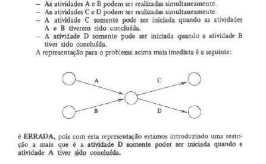<br>
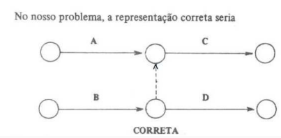<br>

## 8. Princípios básicos para construção de redes

1. Listar as atividades do projeto.
2. Definir a duração de cada atividade.
3. Definir as interdependências (sequência lógica), identificando quais atividades podem ocorrer simultaneamente (economia de tempo total).

Quais as atividades podem ser executadas simultaneamente (economia do tempo total).

Atividade consome tempo e/ou recursos financeiros, já evento não.

Atividade só pode ser executada se o evento inicial foi atingido, ou seja, concluídas todas as atividades que a ele chegam.

Entre dois eventos sucessivos existe somente uma atividade.
Tudo que consome tempo e pode ser previsto é uma atividade. 

Exemplos:
* Cura do concreto;
* Demora na entrega de material;
* Disponibilidade de equipamento.

Não existem atividades em sentido retrógrado. A rede não permite “looping” – flui sempre para o futuro.


## 9. Datas cedo e tarde

- **Data cedo (DC):** primeira data em que se abre a possibilidade de iniciar as atividades que se originam de um determinado evento.
- **Data tarde (DT):** última data em que devem estar concluídas todas as atividades que chegam a um determinado evento, sem atrasar o projeto.

Em notação CPM equivalente:
- **ES** (*Early Start*) / **EF** (*Early Finish*) — início/término mais cedo.
- **LS** (*Late Start*) / **LF** (*Late Finish*) — início/término mais tarde.


## 10. Folgas

**Folga** é a diferença entre o tempo disponível para realizar uma atividade e sua duração.

### Folga total (flexibilidade do cronograma)
Quantidade de tempo que uma atividade pode ser atrasada ou estendida a partir de sua data de início mais cedo, **sem atrasar a data de término do projeto** nem violar uma restrição do cronograma.

```
Ft = (Dtf - Dci) - d
```
onde `Dtf` = data tarde final, `Dci` = data cedo inicial, `d` = duração da atividade.

### Folga livre (*free float*)
Tempo permitido para atraso de uma atividade **sem atrasar a data de início mais cedo de qualquer atividade sucessora imediata**.

```
Fl = (Dcf - Dci) - d
```
onde `Dcf` = data cedo final, `Dci` = data cedo inicial, `d` = duração da atividade.

---

## 11. Caminho crítico

Conjunto de atividades ou etapas de um projeto que **não podem sofrer atrasos** em sua execução sem prejudicar o prazo final do projeto. É o caminho mais longo da rede, com a menor (ou nula) folga.

Objetivos da análise do caminho crítico:
- Determinar quais etapas devem seguir uma programação rígida para que o projeto não atrase.
- Determinar como executar as etapas sem exceder os recursos disponíveis.
- Determinar o custo de execução do projeto e como ele se comporta ao se tentar acelerar a execução.


## 12. Fases de execução (planejamento, programação, controle)

1. **Planejamento:** estabelece as atividades necessárias à conclusão do projeto, suas relações de dependência, e a ordem de execução (diagrama de flechas/rede).
2. **Programação:** estabelece o tempo de execução de cada atividade e identifica quais delas determinam a duração total do projeto (caminho crítico).
3. **Controle:** acompanha a execução do projeto, confrontando-a com o planejado/programado, gerando informações para intervenções e tomada de decisão.

Planejamento e programação devem estar completos antes do início do projeto; o controle ocorre durante a execução, é o meio de reconhecer as dificuldades durante a execução.

#### Classificação de projetos quanto à duração
* Projetos de longa duração – Construção de uma fábrica
* Projetos de média duração – Fazer o jantar
* Projetos de curta duração – Manutenção de uma máquina – Limpeza de uma sal


## 13. Softwares que usam PERT/CPM

- **Microsoft Project** — diagramas de Gantt, cálculo de caminho crítico, análise PERT, relatórios.
- **Primavera P6 (Oracle)** — gestão de projetos/portfólios complexos, análise de riscos, usado em engenharia/construção/manufatura.
- **Trello** — gestão baseada em Kanban (to do / doing / done); não é uma ferramenta de rede PERT/CPM propriamente, mas é citada como parte do ecossistema de gerenciamento de projetos.


## 14. Bibliografia

- HIRSCHFELD, H. *Planejamento com PERT-CPM e análise de desempenho: método manual e por computadores aplicados a todos os fins*. 9. ed. rev. e ampl. São Paulo: Atlas, 1987. 335 p.
- KERZNER, H. *Project Management: A Systems Approach to Planning, Scheduling, and Controlling*. ISBN 978-1119587293.
- MEREDITH, J. R.; MANTEL Jr., S. J.; SHAFER, S. M. *Project Management: A Managerial Approach*. ISBN 978-1118945834.
- PROJECT MANAGEMENT INSTITUTE (PMI). *A Guide to the Project Management Body of Knowledge (PMBOK Guide)*. ISBN 978-1628256642.
- EAST, W. *Critical Path Method (CPM) Tutor for Construction Planning and Scheduling*. ISBN 978-1260440362.
- SRINATH, L. S. *PERT and CPM: Techniques for Project Management*. ISBN 978-8178000000.

---

> **Nota:** os exercícios dirigidos (planejamento da construção de uma casa popular; construção de rede PERT/CPM com cálculo de datas cedo/tarde e folgas) foram propositalmente deixados fora deste documento e podem ser adicionados depois, resolvidos, como material complementar.