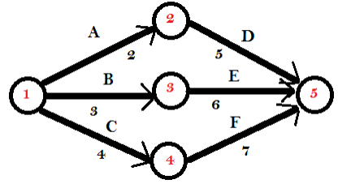
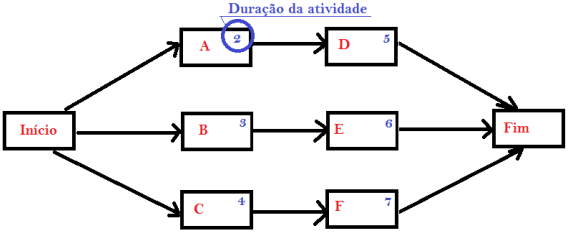
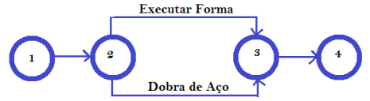
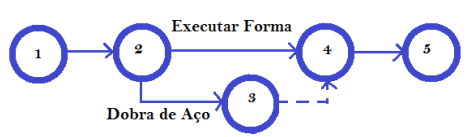
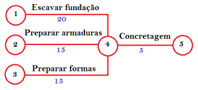
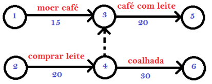
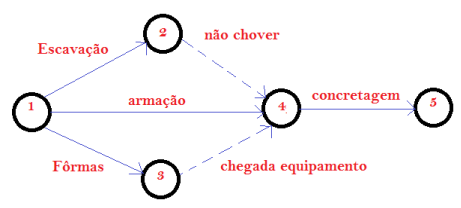

# Planejamento do Projeto

## PERT (Técnica de Avaliação e Revisão de Programas - Program Evaluation and Review Technique)
* Propósito: Lidar com tempos de atividade incertos e fornecer um modelo probabilístico para gerenciamento de projetos. (Prazo probabilístico,  não se sabe o tempo)
* Foco: Tempo
* Componentes Principais:
<ul>

* Atividades: Tarefas necessárias para completar o projeto.
* Eventos/Marcos: Pontos-chave que marcam o início ou fim de uma ou mais atividades.
* Diagrama de Rede: Uma representação visual das atividades e marcos do projeto.
* Três Estimativas de Tempo:

<ul>

* Tempo Otimista (O): O tempo mínimo necessário para concluir uma atividade.
* Tempo Mais Provável (M): A melhor estimativa do tempo necessário para concluir uma atividade,
assumindo que tudo ocorra normalmente.
* Tempo Pessimista (P): O tempo máximo necessário para concluir uma atividade, assumindo
condições desfavoráveis.

</ul>
</ul>

* Tempo Esperado (TE):
TE=O+4M+P/6

* Aplicação: Adequado para projetos com alta incerteza na duração das atividades, como projetos de pesquisa e desenvolvimento.

Antes da Rede PERT utilizava-se o gráfico de Gantt. Rede (Network) PERT não se tem idéia do tempo necessário (não há similaridade).

## CPM (Método do caminho crítico - Critical Path Method)

* Propósito: Determinar o caminho mais longo das atividades planejadas até o final do projeto e
identificar os horários mais cedo e mais tarde que cada atividade pode começar e terminar sem atrasar
o projeto. (Prazo determinístico, sabe o tempo)
* Foco: Tempo e Custo
* Componentes Principais:
<ul>

* Atividades: Tarefas que precisam ser realizadas.
* Dependências: As relações entre as tarefas.
* Diagrama de Rede: Uma representação visual/gráfica das atividades e dependências do projeto.
* Caminho Crítico: O caminho mais longo do projeto com a menor quantidade de folga,
determinando o menor tempo para concluir o projeto.
* Folga: A quantidade de tempo que uma atividade pode ser atrasada sem atrasar o projeto.
* Início Mais Cedo (ES) e Término Mais Cedo (EF): Os horários mais cedo que uma atividade
pode começar e terminar.
* Início Mais Tarde (LS) e Término Mais Tarde (LF): Os horários mais tarde que uma atividade
pode começar e terminar sem atrasar o projeto.

</ul>
* Aplicação: Adequado para projetos com atividades e durações bem definidas, como projetos de
construção. Muito utilizado na construção civil onde existe uma experiência acumulada e
tempos conhecidos (ou produtividade estimada).

## Rede PERT/CPM
A apresentação em forma de rede, permite identificar interdependências e a sequência lógica das atividades. Atividades realizadas, em caso de atraso, repercutem diretamente no prazo final do projeto.

### Princípios Básicos para Redes
1. Listar atividades;
2. Definir durações das atividades;
3. Definir interdependências (seqüências lógicas).

Quais as atividades podem ser executadas simultaneamente (economia do tempo total).

Atividade consome tempo e/ou recursos financeiros, já evento não.
Atividade só pode ser executada se o evento inicial foi atingido, ou seja, concluídas todas as atividades que a ele chegam.

Entre dois eventos sucessivos existe somente uma atividade. Tudo que consome tempo e pode ser previsto é uma atividade. 

Exemplos:
* Cura do concreto;
* Demora na entrega de material;
* Disponibilidade de equipamento.

Não existem atividades em sentido retrógrado. A rede não permite “looping” – flui sempre para o futuro.

### Método americano

### Método francês

### Exemplo 01:

As atividades A,B e C são precedentes de D,E e F. Sendo que não há precedência entre A,B e C.
Represente graficamente a “Rede” pelos dois métodos.

$$
\begin{array}{c|c}
  \text{Atividade} & \text{Duração} \\
  \hline
        A & 2\\
        B & 3\\
        C & 4\\
        D & 5\\
        E & 6\\
        F & 7
\end{array}
$$

### Tipos de Atividades
1. Atividades Fantasmas;
2. Atividades Dependentes;
3. Atividades Independentes;
4. Atividades Condicionantes.

#### Atividade Fantasma:
Atividades fictícias. Devem ser criadas quando existirem atividades paralelas.

“Executar Forma” e “Dobra de Aço” são paralelas e se realizam entre os eventos “2” e “3”. Designadas “Atividade 2-3”, certamente no planejamento geraria confusão.

Portanto cria-se: 

O evento “3” e a atividade “3-4” são fictícias. A atividade fantasma é representada por uma linha orientada (seta) tracejada.

#### Atividade Dependente:
Depende do cumprimento integral de outras atividades. Qualquer atividade que parte de um nó é uma atividade dependente das atividades que chegam a esse nó.

#### Atividades Independentes:

“3-5” – “café com leite” depende de “1-3” e “2-4”.

“4-6” – “coalhada” depende apenas de “2-4”.

“Café com leite” sai do nó “4” como “3-5” e depende de “2-4”, para isso temos de criar a atividade fantasma “4-3”.

#### Atividades Condicionantes:
Quando impõe uma restrição ou uma data para a realização de outra atividade. Como não consomem tempo nem recursos, as atividades condicionantes são sempre atividades fantasmas.

Exemplo:
Planejamento da concretagem de um bloco de fundação de um equipamento
mecânico.

* Escavação fundação;
* Fôrmas;
* Armação;
* Ausência de Chuvas;
* Concretagem;
* Chegada do Equipamento na obra.

A atividade “3-4” poderia ser uma restrição de data, exemplo: “Não iniciar antes de 30/10/2009”.

## Bibliografia
HIRSCHFELD, H. Planejamento com PERT-CPM e análise de desempenho: método
manual e por computadores aplicados a todos os fins. 9. Ed. Revisada e ampliada. Atlas. São Paulo. 1987. 335 páginas.