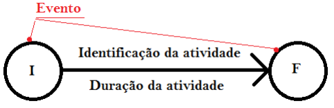
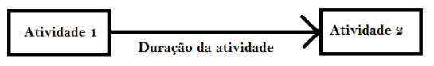

# Planejamento do Projeto

## PERT (Técnica de Avaliação e Revisão de Programas)
* Propósito: Lidar com tempos de atividade incertos e fornecer um modelo probabilístico para gerenciamento de
projetos. 
* Foco: Tempo
* Componentes Principais:
<ul>

* Atividades: Tarefas necessárias para completar o projeto.
* Eventos/Marcos: Pontos-chave que marcam o início ou fim de uma ou mais atividades.
* Diagrama de Rede: Uma representação visual das atividades e marcos do projeto.
* Três Estimativas de Tempo:

<ul>

* Tempo Otimista (O): O tempo mínimo necessário para concluir uma atividade.
* Tempo Mais Provável (M): A melhor estimativa do tempo necessário para concluir uma atividade,
assumindo que tudo ocorra normalmente.
* Tempo Pessimista (P): O tempo máximo necessário para concluir uma atividade, assumindo
condições desfavoráveis.

</ul>
</ul>

* Tempo Esperado (TE):
TE=O+4M+P/6

* Aplicação: Adequado para projetos com alta incerteza na duração das atividades, como projetos de
pesquisa e desenvolvimento.

## CPM (Método do caminho crítico)

* Propósito: Determinar o caminho mais longo das atividades planejadas até o final do projeto e
identificar os horários mais cedo e mais tarde que cada atividade pode começar e terminar sem atrasar
o projeto.
* Foco: Tempo e Custo
* Componentes Principais:
<ul>

* Atividades: Tarefas que precisam ser realizadas.
* Dependências: As relações entre as tarefas.
* Diagrama de Rede: Uma representação visual/gráfica das atividades e dependências do projeto.
* Caminho Crítico: O caminho mais longo do projeto com a menor quantidade de folga,
determinando o menor tempo para concluir o projeto.
* Folga: A quantidade de tempo que uma atividade pode ser atrasada sem atrasar o projeto.
* Início Mais Cedo (ES) e Término Mais Cedo (EF): Os horários mais cedo que uma atividade
pode começar e terminar.
* Início Mais Tarde (LS) e Término Mais Tarde (LF): Os horários mais tarde que uma atividade
pode começar e terminar sem atrasar o projeto.

</ul>
* Aplicação: Adequado para projetos com atividades e durações bem definidas, como projetos de
construção.

## Rede PERT/CPM
A apresentação em forma de rede, permite identificar interdependências e a sequência lógica das atividades. Atividades realizadas, em caso de atraso, repercutem diretamente no prazo final do projeto.

### Método americano

### Método francês
